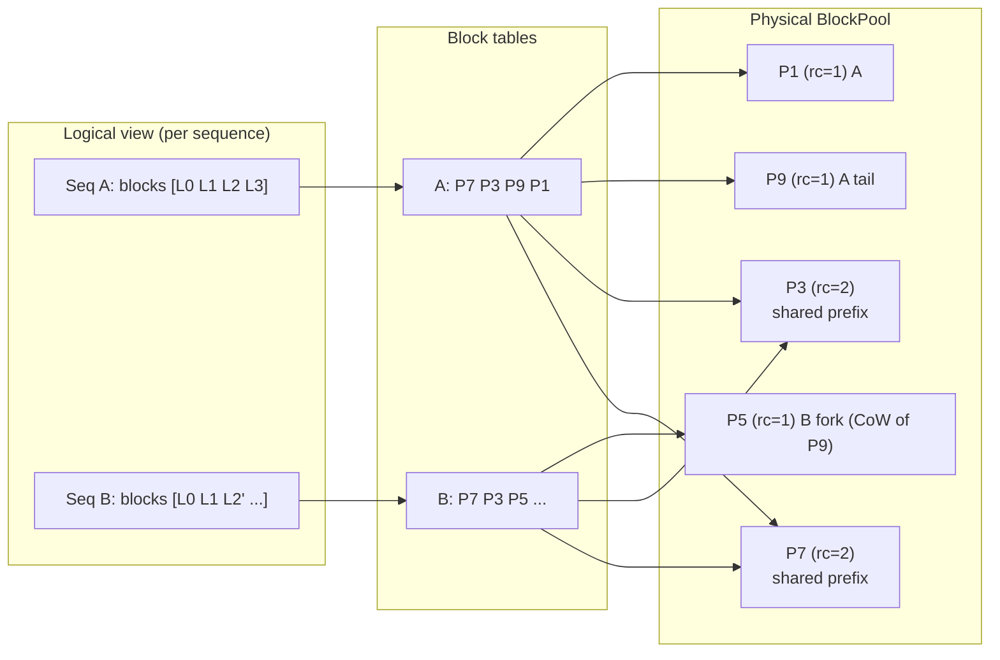

# ADR-258: Paged Block-Based KV Cache Management and Enhanced Prefix Sharing

**Status:** Proposed
**Date:** 2026-06-18
**Authors:** RuVector Team, ruv.io
**Deciders:** Architecture Review Board
**Technical Area:** RuvLLM Inference Engine / KV Cache Management
**SDK:** Claude-Flow

## Version History

| Version | Date | Author | Changes |
|---------|------|--------|---------|
| 0.1 | 2026-06-18 | RuVector Team | Initial proposal |

---

## Context

RuVector's serving layer (`ruvllm`) drives long-lived, highly concurrent **agentic** workloads: persistent agent sessions, Graph-RAG retrieval, multi-turn tool-use loops, and speculative/branching reasoning. These workloads share three structural properties that the current KV cache design handles poorly:

1. **Heavy prefix sharing** — agents reuse the same system prompts, tool schemas, and retrieved document chunks across thousands of requests.
2. **Unpredictable, divergent sequence lengths** — branching reasoning and tool loops fork from a shared context, then diverge.
3. **High session concurrency** — a single host may hold hundreds of "warm" agent sessions, most of which are idle between turns.

### Current State in RuvLLM

Two relevant subsystems already exist:

- **ADR-004 (KV Cache Management)** — a 3-tier *adaptive quantization* design (FP16 hot buffer → 4-bit warm → 2-bit/SQuat/KVQuant archive) with rematerialization and quality-aware policies. Implemented today as `TwoTierKvCache` / `PooledKvCache` / `TurboQuantKvCache` in `crates/ruvllm/src/kv_cache.rs`. **This ADR-004 work answers "how few bits per token?"**
- **ADR-011 (Prefix Caching)** — a Radix Tree + copy-on-write design (SGLang RadixAttention style) for sharing KV states across requests. **This ADR-011 work answers "which requests share which tokens?"**

A first-pass `paged_attention.rs` exists (`PageBlock` / `PageTable` / `PagedAttention`, mistral.rs-inspired), but it is incomplete for production agent serving:

| Gap | Consequence |
|-----|-------------|
| No dedicated **physical block pool** distinct from logical block tables | Cannot decouple a sequence's logical layout from physical residency |
| Block `ref_count` exists but no **copy-on-write split** on shared blocks | Forking a sequence corrupts the parent, or forces full copies |
| No **content-addressed block hashing** | Prefix sharing is request-level (ADR-011) but not *block-level*; partial-block tails cannot be deduplicated cheaply |
| No **per-block quantization tier** | ADR-004's tiering cannot compose with paging; the warm/archive tiers live in a separate cache type |
| Contiguous per-sequence buffers | Internal fragmentation — a 4097-token sequence reserves the next power-of-two/contiguous slab; idle sessions pin memory |

### The Missing Primitive

The current design forces a choice between *contiguous, fragmentation-prone* per-sequence buffers and *quantized-but-monolithic* tiered caches. Neither lets the engine ask:

> "Give every sequence a **virtual** KV address space backed by a **shared pool of fixed-size physical blocks**, so that identical prefixes occupy one physical copy, divergence triggers a cheap copy-on-write of a single block, and each block carries its own quantization tier."

That virtual-memory-for-KV abstraction is the missing primitive. It is exactly what **PagedAttention** (vLLM) introduced, and it is the substrate on which both ADR-004 and ADR-011 become dramatically more effective.

---

## Decision

Adopt **PagedAttention-style block-based KV cache management** in RuvLLM as the unifying memory substrate, implemented as a new `paged_kv` submodule in `crates/ruvllm`. The design has three pillars:

1. **Fixed-size physical blocks in a shared pool.** KV cache is stored in uniform blocks of `block_size` tokens (default 16). A `BlockPool` owns all physical blocks and a free list; allocation is O(1).

2. **Per-sequence block tables (logical → physical).** Each sequence holds a `BlockTable` — an ordered list of physical block IDs — giving it a contiguous *logical* address space over a *non-contiguous* physical layout. This is the page-table analogy.

3. **Content-addressed blocks for sharing + copy-on-write.** Full blocks are sealed with a chained content hash `h_i = hash(h_{i-1} || tokens_i)`. Identical prefixes map to the *same physical block* via the prefix index; reference counts guard sharing; writing into a shared block triggers a single-block CoW copy.

### Logical vs. Physical View



Sequences A and B share the first two blocks (`P7`, `P3`, refcount 2). When B diverges at logical block 2, the engine copies just that one block (`P9` → `P5`) — copy-on-write at block granularity, not sequence granularity.

### ASCII: Block table indexing

```text
 logical token position  ──►  ( block_idx , offset )
 block_idx = pos / block_size
 offset    = pos % block_size

 Seq A BlockTable:   [ P7 | P3 | P9 | P1 ]
                       0    1    2    3      (logical block index)
                        \    \    \    \
                         \    \    \    └─ physical block 1
                          \    \    └────  physical block 9
                           \    └───────   physical block 3   (rc=2, shared)
                            └──────────    physical block 7   (rc=2, shared)
```

### Integration with the Radix Tree (ADR-011)

ADR-011's radix tree becomes **block-aligned**: tree edges key on *block content hashes* rather than raw token runs. A radix node points at a physical `BlockId`. This is the hybrid that ADR-011 explicitly flagged as future work ("block-aligned radix tree could reduce fragmentation").

```mermaid
flowchart TD
    Root(("root"))
    Root -->|hash(sys_prompt blk0)| N0["BlockId P7\nrc"]
    N0 -->|hash(blk1)| N1["BlockId P3\nrc"]
    N1 -->|hash(toolA blk2)| N2a["BlockId P9"]
    N1 -->|hash(toolB blk2)| N2b["BlockId P5"]
```

Looking up a new request walks the radix tree by block hash, incref-ing each matched physical block and appending it to the new sequence's block table — **zero KV recomputation** for the shared prefix, at block granularity.

### Integration with Tiered Quantization (ADR-004)

Quantization moves *inside the block*: each `PhysicalBlock` carries a `QuantTier` (`Fp16` hot / `Int4` warm / `Int2` archive). A `BlockQuantizer` trait compresses/decompresses block payloads. Tier transitions become block-level operations driven by ADR-004's staleness/quality policy — re-quantizing a block in place rather than shuffling a monolithic buffer. Hot tail blocks stay FP16; sealed older blocks demote to 4-bit then 2-bit. Because blocks are content-addressed *before* RoPE-free key hashing, shared archive blocks are quantized once and reused.

---

## Rationale

| Decision | Why |
|----------|-----|
| Fixed-size blocks | O(1) allocation, near-zero external fragmentation, uniform pool management (vLLM's core insight). |
| Block table indirection | Decouples logical sequence length from physical residency; idle sessions can be paged/quantized without moving the sequence's logical view. |
| Content-addressed chained hashing | Enables *automatic* prefix sharing without the caller declaring prefixes; partial agent contexts dedupe naturally. |
| Block-granular CoW | Forking a reasoning branch copies one block, not the whole context — critical for speculative/branching agent loops. |
| Per-block quant tier | Lets ADR-004 and paging compose instead of competing; a block is the unit of both residency and precision. |
| Pure-Rust, pool-first | Memory-safe, no GPU dependency required for the allocator; GPU kernels (FA-3/Metal/cudarc) plug in behind a trait later. |

### Why blocks of 16?

`block_size = 16` matches vLLM's default and balances:
- **Sharing granularity** — smaller blocks share more partial prefixes but cost more table/hash overhead.
- **Fragmentation** — average waste is `block_size/2` tokens per sequence tail (8 tokens), negligible vs. contiguous slabs.
- **Kernel efficiency** — 16 aligns with typical warp/tile sizes for paged attention kernels.

It is configurable per model.

---

## Alternatives Considered

1. **Keep contiguous per-sequence buffers (status quo `kv_cache.rs`).** Rejected: external fragmentation and 2× memory headroom requirement under concurrency; can't share partial prefixes.
2. **Request-level radix sharing only (ADR-011 alone).** Rejected: shares whole cached prefixes but still allocates contiguous buffers per live sequence and cannot CoW a single block on divergence.
3. **Quantization only (ADR-004 alone).** Rejected: fewer bits per token helps capacity but does nothing for fragmentation, sharing, or fork cost.
4. **Fixed-block prefix cache without a pool (the existing `PageTable`).** Rejected as incomplete: no physical/logical split, no CoW split, no content hashing, no per-block tier — this ADR supersedes it.

**This ADR is explicitly complementary**: PagedAttention is the *substrate*; ADR-011 supplies the *sharing policy* (radix index over blocks) and ADR-004 supplies the *precision policy* (per-block tier). Adoption is incremental and coexists with current code paths behind a feature flag.

---

## Consequences

### Positive

1. **2–4× throughput** in high-concurrency serving (vLLM/SGLang-class gains) from eliminated fragmentation and higher batch occupancy.
2. **5–10× TTFT reduction** in high-sharing scenarios (shared system prompts / RAG chunks) via block-level prefix reuse with zero recomputation.
3. **2–4× more concurrent agent sessions** within the same memory budget (near-zero external fragmentation + sharing).
4. **Cheap forking** for speculative/branching agents — single-block CoW instead of full-context copy.
5. **Composability** — ADR-004 tiering and ADR-011 radix sharing both become block operations on one substrate.
6. **Memory safety** — Rust ownership + reference counting make the sharing/CoW invariants checkable and testable.

### Negative

1. **Implementation complexity** — physical/logical indirection, refcounts, CoW, and hash chaining add code and invariants. Mitigated by property-based tests of sharing correctness.
2. **Indirection cost** — paged attention kernels gather non-contiguous blocks; ~5–15% kernel overhead vs. contiguous (well-established in vLLM literature, dwarfed by occupancy gains).
3. **Block table metadata** — small per-sequence overhead (a `Vec<BlockId>`), ~4 bytes/block.
4. **Two cache code paths during migration** — legacy contiguous cache and paged cache coexist until the paged path is the default.

### Neutral / Risk Mitigation

| Risk | Mitigation |
|------|-----------|
| CoW correctness bugs | `proptest` invariants: shared blocks never mutated in place; refcount == number of referencing tables. |
| Hash collisions causing wrong sharing | 64-bit chained hash + optional full-token verification on match (configurable). |
| Pool exhaustion under load | Eviction hook (LRU over unreferenced full blocks) + ADR-004 demotion to free pressure. |
| Kernel gather overhead | Start CPU-correct, add SIMD/GPU paged kernels in Phase 6. |

---

## Performance Expectations

Ranges below are drawn from published vLLM and SGLang results, scaled to RuVector's agent workloads. Treated as **targets**, validated by the Phase 5–6 benchmark suite.

| Metric | Baseline (contiguous) | Paged + sharing | Expected gain |
|--------|----------------------|-----------------|---------------|
| Serving throughput (tok/s, batched) | 1.0× | 2–4× | vLLM PagedAttention range |
| TTFT, high prefix sharing (chat/RAG/agents) | 1.0× | 0.1–0.2× | 5–10× reduction |
| Concurrent sessions / GB | 1.0× | 2–4× | fragmentation + sharing |
| External fragmentation | 30–60% slack | <4% (≤ block_size/2 per tail) | dramatic |
| Fork cost (branch a reasoning path) | O(context) copy | O(1 block) CoW | orders of magnitude |
| Block allocate/free | n/a | < 100 ns | O(1) free-list |

Combined with ADR-004, archive-tier blocks add the existing 8–22× per-block memory reduction *on top of* paging's fragmentation wins.

---

## Implementation Plan (Phased)

### Phase 1 — Core block allocator + block table
- `BlockPool` (physical blocks, free list, refcounts), `PhysicalBlock`, `BlockTable`, `PagedKvConfig`.
- Allocation/deallocation, logical→physical lookup, append with auto-allocation.
- Unit tests: allocate/free roundtrip, pool exhaustion, block fill/overflow.

### Phase 2 — Prefix sharing + copy-on-write
- Chained block content hashing; `PrefixIndex` (block-hash → `BlockId`).
- `fork` / `share_prefix` APIs: incref shared blocks into a new block table.
- CoW split on write to a shared block (refcount > 1).
- `proptest` sharing-correctness invariants.

### Phase 3 — Quantization layering (ADR-004)
- `QuantTier` per block, `BlockQuantizer` trait, identity + Int4/Int2 adapters bridging existing quantizers.
- Tier-demotion policy hook (staleness/quality from ADR-004).

### Phase 4 — Continuous batching hooks
- Scheduler-facing API: admit/evict, per-step block budget, swap-out (CPU) of cold sessions.
- Block eviction policy (LRU over unreferenced sealed blocks).

### Phase 5 — Testing & micro-benchmarks
- Criterion micro-benches: allocation throughput, append, lookup, fork.
- Property tests for refcount/CoW invariants.

### Phase 6 — Full integration & end-to-end benchmarks
- Wire into `serving` / `session` paths behind `paged-kv` feature flag.
- Radix-tree (ADR-011) block-aligned integration; FA-3 / Metal / cudarc paged-attention kernel behind `BlockAttention` trait.
- End-to-end TTFT / throughput / concurrency benchmarks vs. contiguous baseline.

---

## Implementation Status

Implemented in `crates/ruvllm/src/paged_kv/` (module `ruvllm::paged_kv`):

| Phase | Status | Artifacts |
|-------|--------|-----------|
| 1 — Allocator + block table | ✅ Done | `pool.rs` (`BlockPool`, `PhysicalBlock`), `table.rs` (`BlockTable`), `mod.rs` (`PagedKvConfig`, `BlockId`) |
| 2 — Prefix sharing + CoW | ✅ Done | `prefix.rs` (`PrefixIndex`, chained hash), `cache.rs` (`allocate_with_prefix`, `fork`, single-block CoW) |
| 3 — Quantization layering | ✅ Done | `quant.rs` (`QuantTier`, `BlockQuantizer`, `Identity`/`Uniform`), `cache.rs::demote_cold_blocks` |
| 4 — Continuous batching | ✅ Done | `scheduler.rs` (`BatchScheduler`: admit/preempt/finish, block-budget + watermark, recompute preemption) |
| 5 — Tests & micro-benchmarks | ✅ Done | 34 unit/`proptest` tests; `benches/paged_kv_bench.rs` (alloc/append/prefix/fork/gather) |
| 6 — Full integration & e2e | ◑ In progress | `attention.rs` (`BlockAttention` trait, `CpuPagedAttention` streaming-softmax kernel verified vs. dense); `serving/paged_kv_manager.rs` (`PagedKvCacheManager` request-keyed adapter, bidirectional Request↔Seq mapping, prefix-aware admit/extend/free + attention); `serving/paged_engine.rs` (`PagedBatchEngine` — a real continuous-batching loop over the paged stack: admission/prefill, per-step decode via a model-agnostic `TokenGenerator`, recompute-policy preemption, completion); `benches/paged_kv_bench.rs::serving_high_sharing`. All behind the `paged-kv` feature. Remaining: drive the production `candle` model decode through `PagedBatchEngine`, GPU paged-attention kernels, real-model throughput/TTFT A/B vs. the contiguous baseline. |

The CPU paged-attention kernel uses a FlashAttention-style online softmax that
streams over blocks (`O(num_heads · head_dim)` memory), which is the exact access
pattern the GPU backends (FA-3 / Metal / cudarc) will implement behind the same
`BlockAttention` trait — so Phase 6 hardware kernels drop in without allocator
changes.

### Runnable demo

`examples/paged_engine_demo.rs` (feature `paged-kv`) drives `PagedBatchEngine`
through a 64-request agent wave sharing a 512-token system prompt:

```bash
cargo run -p ruvllm --no-default-features --features minimal,paged-kv \
  --example paged_engine_demo
```

Representative output: 63/64 requests reuse the cached prompt (32,256 prefix
tokens shared), **peak 224 blocks vs. 2,176 for a contiguous baseline — 89.7%
fewer blocks at peak** — with the pool fully reclaimed at drain (no leaks). This
exercises the complete allocate → share → CoW → preempt → free path.

### Real-model wiring: the candle KV seam

The engine is model-agnostic via the `TokenGenerator` trait; a production
generator backs onto the model decode step and `PagedKvCacheManager::attention`.
A faithful real-model path is currently **blocked upstream**: `candle-transformers`
models own their KV cache internally and the `LlmBackend` trait exposes only
text/token generation (`generate`/`generate_stream`/`embed`), not the per-layer
K/V projections the paged pool needs to store. Closing this requires either a
custom attention layer that externalizes K/V (cf. the hand-rolled
`backends/gemma2.rs` which already threads `kv_cache: (&mut Vec<f32>, &mut Vec<f32>)`)
or an upstream hook — tracked as the remaining Phase 6 work alongside GPU
kernels and a real-model throughput/TTFT A/B.

---

## References

1. Kwon, W. et al. *Efficient Memory Management for Large Language Model Serving with PagedAttention* (vLLM), SOSP 2023. https://arxiv.org/abs/2309.06180
2. Zheng, L. et al. *SGLang: Efficient Execution of Structured Language Model Programs* (RadixAttention). https://arxiv.org/abs/2312.07104
3. Liu, Z. et al. *KIVI: A Tuning-Free Asymmetric 2bit Quantization for KV Cache.* arXiv:2402.02750, 2024.
4. Hooper, C. et al. *KVQuant: Towards 10 Million Context Length LLM Inference.* arXiv:2401.18079, 2024.
5. RuVector **ADR-004**: KV Cache Management — `docs/adr/ADR-004-kv-cache-management.md` (3-tier adaptive quantization).
6. RuVector **ADR-011**: Prefix Caching — `docs/adr/ADR-011-prefix-caching.md` (Radix Tree + CoW sharing).
7. RuVector **ADR-147**: Stacked KV Cache / TriAttention / TurboQuant.
8. RuVector **ADR-189**: Sparse Attention KV Cache / Incremental Decode.

---

## Related Decisions

- **ADR-004** — KV Cache Management (precision policy; this ADR makes its tiers per-block).
- **ADR-011** — Prefix Caching (sharing policy; this ADR makes its radix tree block-aligned).
- **ADR-147** — Stacked KV Cache / TurboQuant (block payload codec source).
- **ADR-189** — Sparse Attention / Incremental Decode (consumer of paged blocks).

---

## Revision History

| Version | Date | Author | Changes |
|---------|------|--------|---------|
| 1.0 | 2026-06-18 | RuVector Architecture Team | Initial proposal |
| 1.1 | 2026-06-18 | RuVector Architecture Team | Add Implementation Status; Phases 1–5 done, Phase 6 substrate (`BlockAttention` kernel) + Phase 4 scheduler landed |
| 1.2 | 2026-06-18 | RuVector Architecture Team | Phase 6 serving integration: `PagedKvCacheManager` behind `paged-kv` feature + high-sharing e2e benchmark |
| 1.3 | 2026-06-18 | RuVector Architecture Team | Phase 6 engine swap-in: `PagedBatchEngine` continuous-batching loop over the paged stack (admission/decode/preemption/completion) |
| 1.4 | 2026-06-18 | RuVector Architecture Team | Add runnable `paged_engine_demo` (89.7% fewer blocks at peak); document the candle KV-externalization seam blocking the real-model path |
