# RuVector Business Logic Overview

## Executive Summary

RuVector is a **self-learning vector database** built in Rust that improves search results automatically with every query. Unlike static vector databases (Pinecone, Weaviate, Milvus), RuVector combines a high-performance HNSW index with a Graph Neural Network (GNN) layer that learns from user interactions in real-time.

**Core Value Proposition**: "The vector database that gets smarter the more you use it."

---

## Core Business Logic

### 1. Self-Learning Search Engine

The fundamental business logic centers on **continuous improvement**:

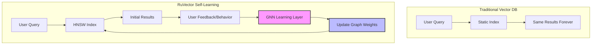

**How Learning Works**:
1. User performs a semantic search
2. HNSW graph returns nearest neighbors
3. GNN observes which results user engages with
4. Q-learning updates edge weights in the HNSW graph
5. Future queries benefit from learned patterns

### 2. Four-Layer Architecture Value Chain

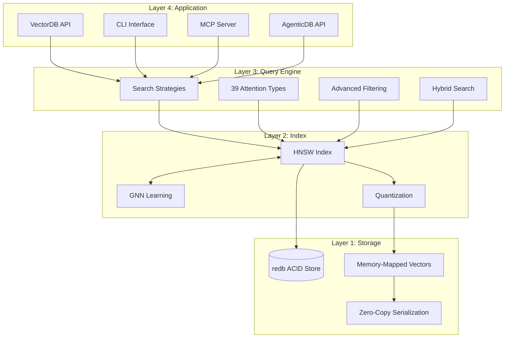

### 3. Multi-Platform Value Delivery

RuVector delivers value across multiple deployment targets:

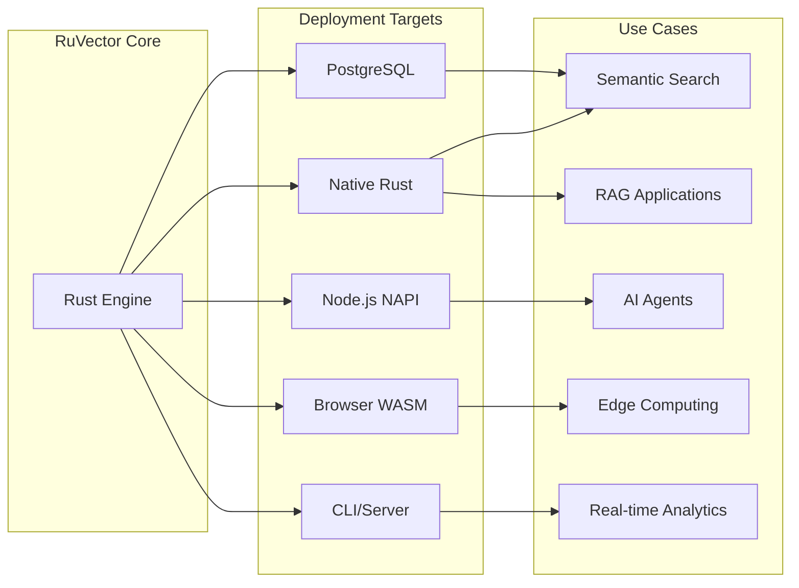

---

## Business Model & Value Drivers

### 1. Cost Reduction

| Traditional Approach | RuVector Approach | Savings |
|---------------------|-------------------|---------|
| Cloud vector DB ($0.10/1K queries) | Self-hosted (free) | 100% |
| External LLM API calls | Local ruvllm inference | 100% |
| Multiple tools (search + graph + LLM) | Single integrated package | 60-80% |
| Manual index tuning | Self-optimizing | Engineering time |

### 2. Performance Improvement

| Metric | Traditional | RuVector | Improvement |
|--------|-------------|----------|-------------|
| Search latency | 50-200ms | 1-10ms | 5-50x |
| Query quality over time | Static | Improving | +55% |
| Memory efficiency | Full precision | Quantized | 4-32x |
| SIMD acceleration | Manual | Automatic | 4-16x |

### 3. Competitive Differentiation

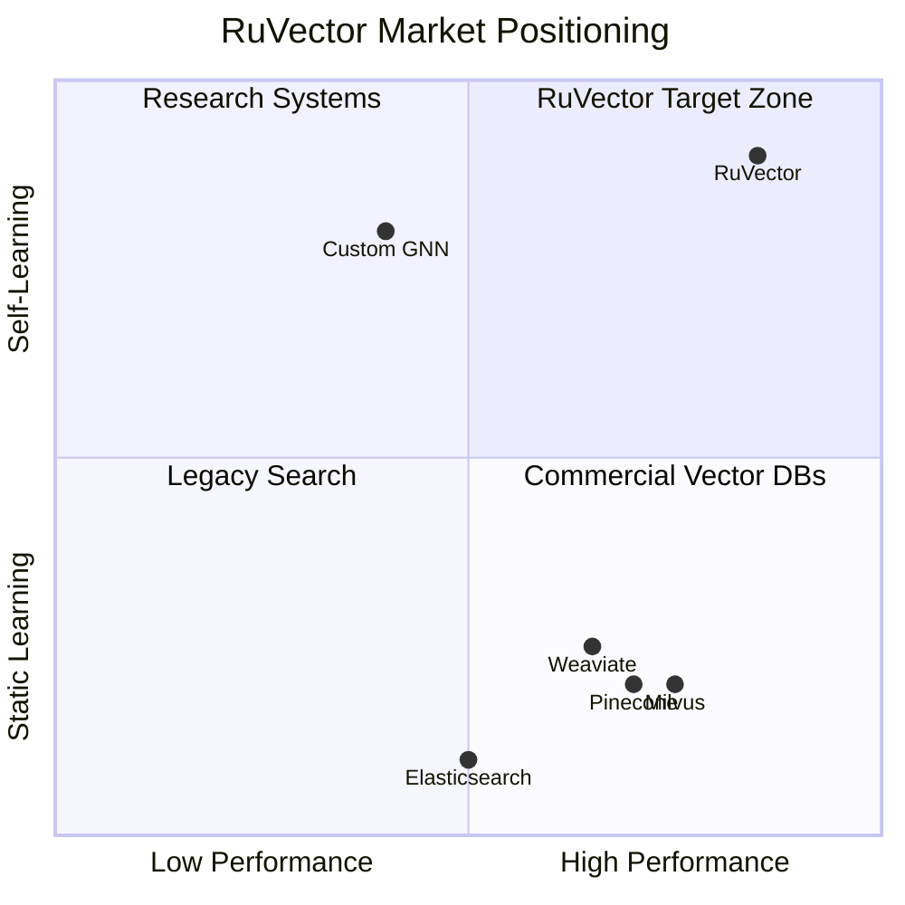

---

## Key Business Capabilities

### Capability 1: Vector Storage & Retrieval

**Business Function**: Store and retrieve high-dimensional vectors with metadata

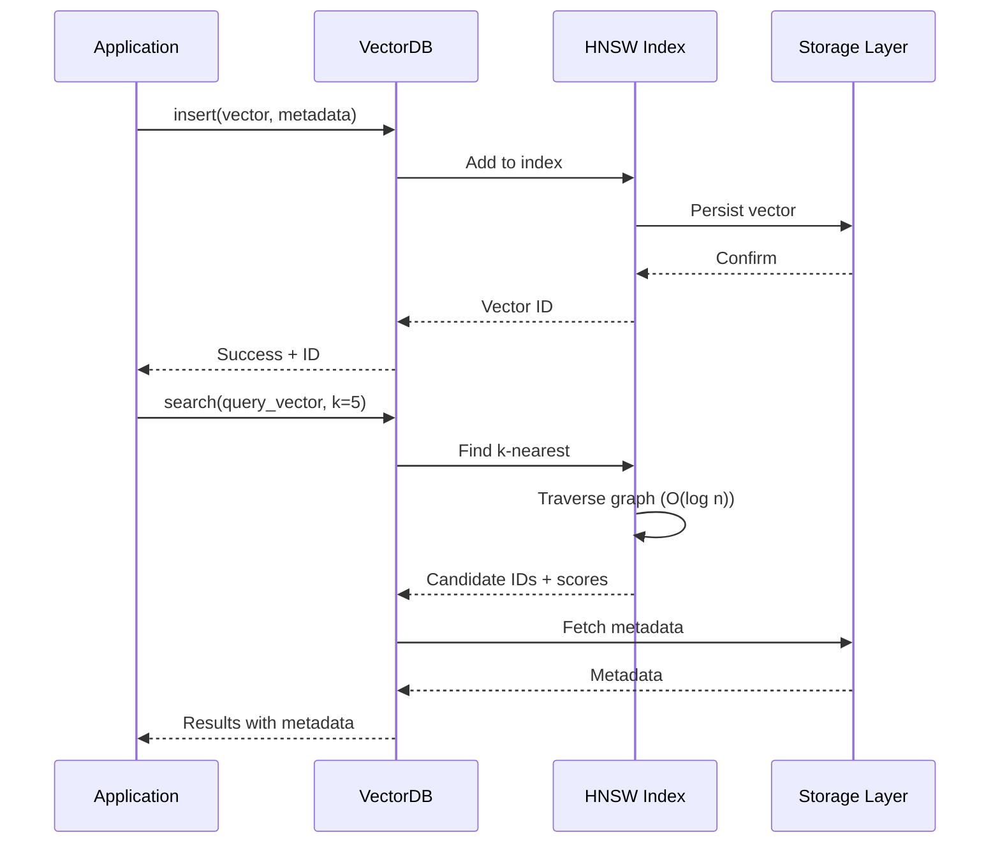

**Business Value**:
- Sub-millisecond search at billion scale
- ACID-compliant persistence
- Zero-copy memory mapping for large datasets

### Capability 2: Self-Improving Search Quality

**Business Function**: Automatic relevance improvement through usage

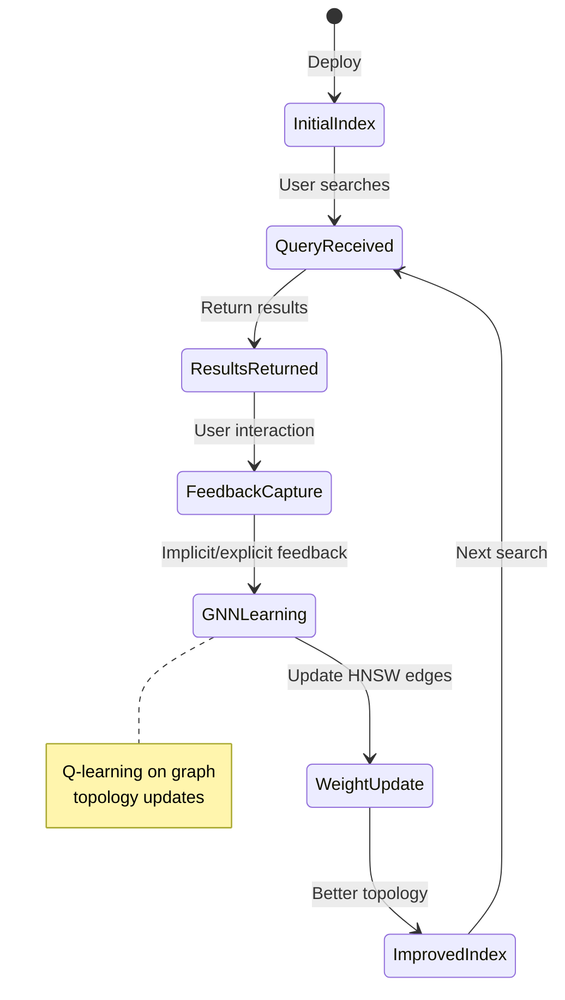

**Business Value**:
- Eliminates manual retraining cycles
- Adapts to domain-specific terminology
- Improves with scale (more queries = better results)

### Capability 3: Local LLM Inference (RuVLLM)

**Business Function**: Run language models locally with zero API costs

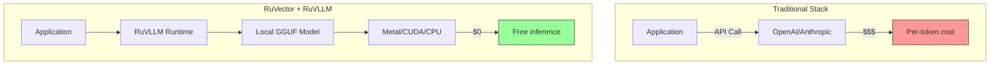

**Business Value**:
- Zero inference costs after model download
- Data stays on-premise (privacy/compliance)
- Latency reduction (no network round-trip)

### Capability 4: Distributed Scaling

**Business Function**: Horizontal scaling without vendor lock-in

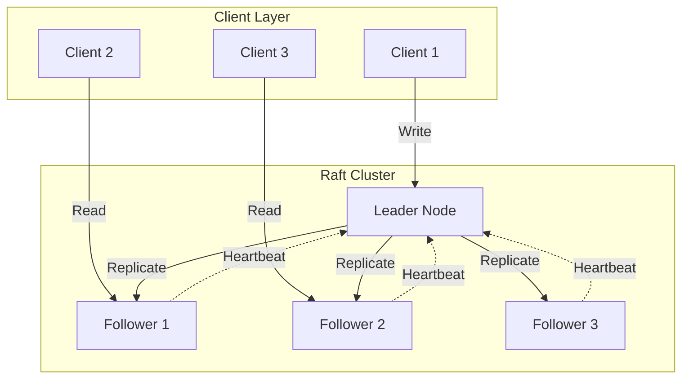

**Business Value**:
- No per-node licensing fees
- Automatic failover
- Linear read scaling

### Capability 5: AI Agent Training (AgenticDB)

**Business Function**: Structured storage for AI agent learning

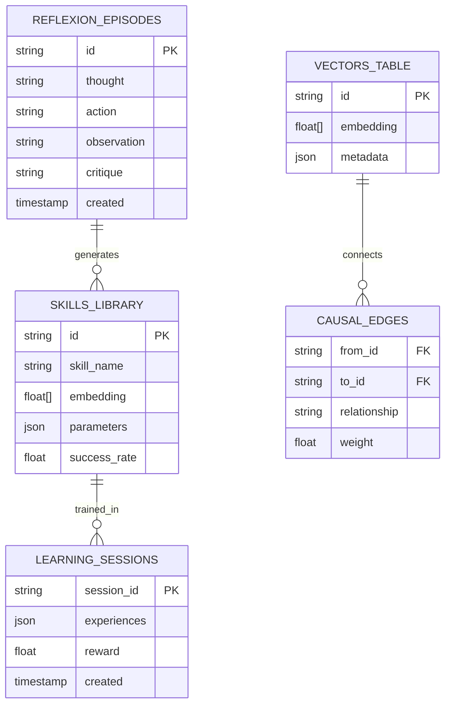

**Business Value**:
- Structured agent memory (vs. flat context)
- Skill consolidation and reuse
- Causal reasoning support

---

## Revenue/Value Streams

### 1. Direct Technical Value

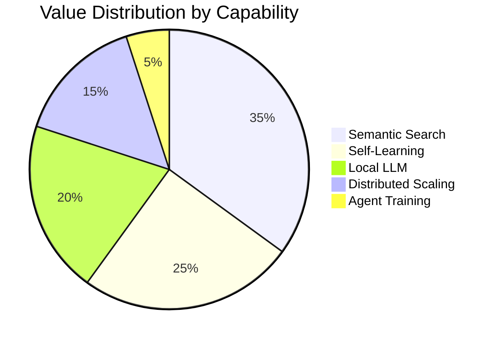

### 2. Integration Ecosystem

| Integration | Value Delivered |
|-------------|-----------------|
| Claude-Flow v3 | Multi-agent orchestration with SONA routing |
| Agentic-Flow v2 | Standalone agent framework |
| RuBot | Long-running agent deployment |
| PostgreSQL | Drop-in pgvector replacement |
| MCP Protocol | AI assistant tool integration |

### 3. Deployment Flexibility

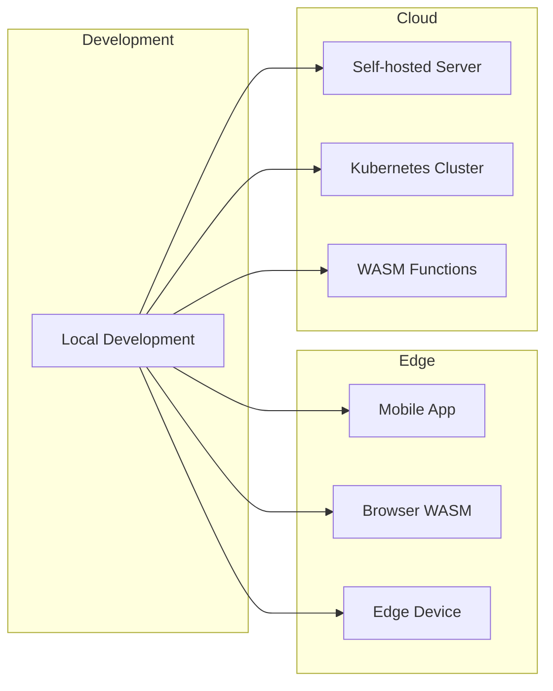

---

## Competitive Analysis

### Feature Comparison

| Feature | RuVector | Pinecone | Weaviate | Milvus |
|---------|----------|----------|----------|--------|
| Self-learning | Yes | No | No | No |
| Local LLM | Yes (ruvllm) | No | No | No |
| Graph queries | Yes (Cypher) | No | GraphQL | No |
| WASM support | Yes | No | No | No |
| PostgreSQL ext | Yes | No | No | No |
| Pricing | Free/Open | Per-query | Self-host | Self-host |
| GNN integration | Native | No | No | No |
| Quantization | 4 types | 1 type | 1 type | 2 types |

### Total Cost of Ownership (1M queries/month)

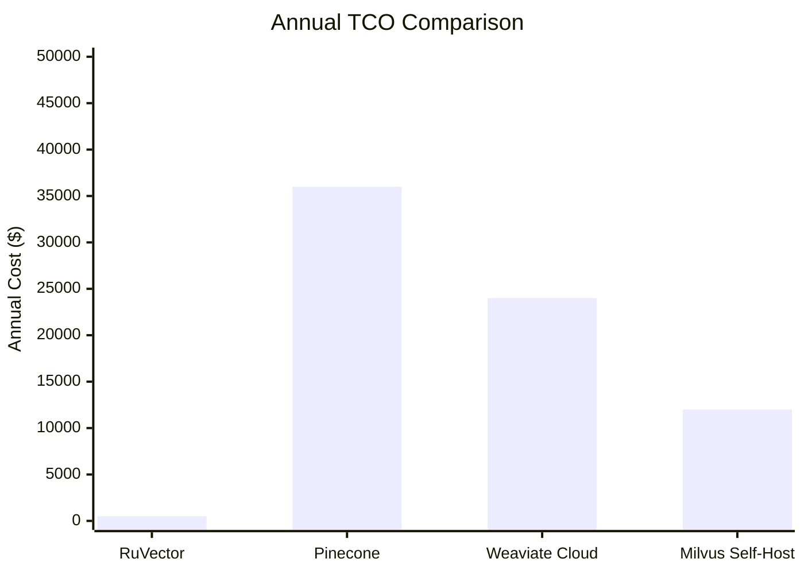

---

## Strategic Implications

### For Startups
- **Zero upfront cost**: Start with free tier, scale as needed
- **No vendor lock-in**: Data portable, open source
- **Fast iteration**: Self-learning reduces tuning cycles

### For Enterprises
- **On-premise deployment**: Data sovereignty compliance
- **Integration ready**: PostgreSQL, MCP, REST APIs
- **Cost predictability**: No per-query pricing surprises

### For AI/ML Teams
- **Research velocity**: 39 attention mechanisms to experiment with
- **Novel architectures**: Mincut-gated transformers, neuromorphic computing
- **Production path**: Research to deployment in same codebase

---

## Summary

RuVector's business logic centers on **reducing friction** in the AI development lifecycle:

1. **Acquisition**: Free, open-source, multi-platform
2. **Adoption**: Familiar APIs (VectorDB, PostgreSQL, REST)
3. **Value Realization**: Self-improving search, local inference
4. **Expansion**: Distributed scaling, agent training
5. **Lock-in Prevention**: Open standards, portable data

The self-learning capability is the **core differentiator**, transforming vector search from a static utility into a continuously improving asset.
