# RuVector User Flows

## Overview

This document details all possible user flows for interacting with RuVector, from initial setup through advanced distributed deployments.

---

## Table of Contents

1. [Basic User Flows](#basic-user-flows)
2. [Developer Flows](#developer-flows)
3. [Production Flows](#production-flows)
4. [AI Agent Flows](#ai-agent-flows)
5. [Integration Flows](#integration-flows)

---

## Basic User Flows

### Flow 1: First-Time Setup

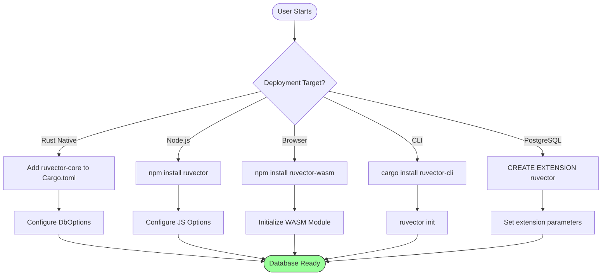
```mermaid
flowchart TD
    Start([User Starts]) --> Choice{Deployment Target?}

    Choice -->|Rust Native| Rust[Add ruvector-core to Cargo.toml]
    Choice -->|Node.js| Node[npm install ruvector]
    Choice -->|Browser| WASM[npm install ruvector-wasm]
    Choice -->|CLI| CLI[cargo install ruvector-cli]
    Choice -->|PostgreSQL| PG[CREATE EXTENSION ruvector]

    Rust --> Config1[Configure DbOptions]
    Node --> Config2[Configure JS Options]
    WASM --> Config3[Initialize WASM Module]
    CLI --> Config4[ruvector init]
    PG --> Config5[Set extension parameters]

    Config1 --> Ready([Database Ready])
    Config2 --> Ready
    Config3 --> Ready
    Config4 --> Ready
    Config5 --> Ready

    style Ready fill:#9f9,stroke:#333
```

### Flow 2: Basic Vector Operations

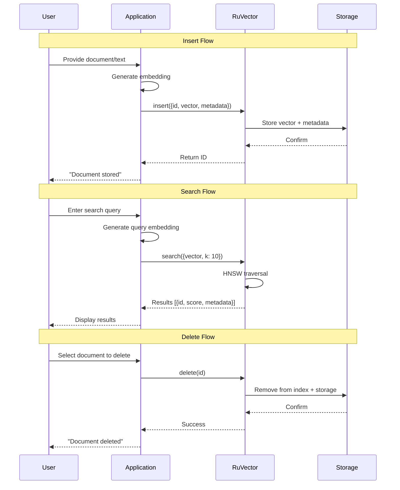
```mermaid
sequenceDiagram
    participant User
    participant App as Application
    participant RuVector
    participant Storage

    Note over User,Storage: Insert Flow
    User->>App: Provide document/text
    App->>App: Generate embedding
    App->>RuVector: insert({id, vector, metadata})
    RuVector->>Storage: Store vector + metadata
    Storage-->>RuVector: Confirm
    RuVector-->>App: Return ID
    App-->>User: "Document stored"

    Note over User,Storage: Search Flow
    User->>App: Enter search query
    App->>App: Generate query embedding
    App->>RuVector: search({vector, k: 10})
    RuVector->>RuVector: HNSW traversal
    RuVector-->>App: Results [{id, score, metadata}]
    App-->>User: Display results

    Note over User,Storage: Delete Flow
    User->>App: Select document to delete
    App->>RuVector: delete(id)
    RuVector->>Storage: Remove from index + storage
    Storage-->>RuVector: Confirm
    RuVector-->>App: Success
    App-->>User: "Document deleted"
```

### Flow 3: Batch Import

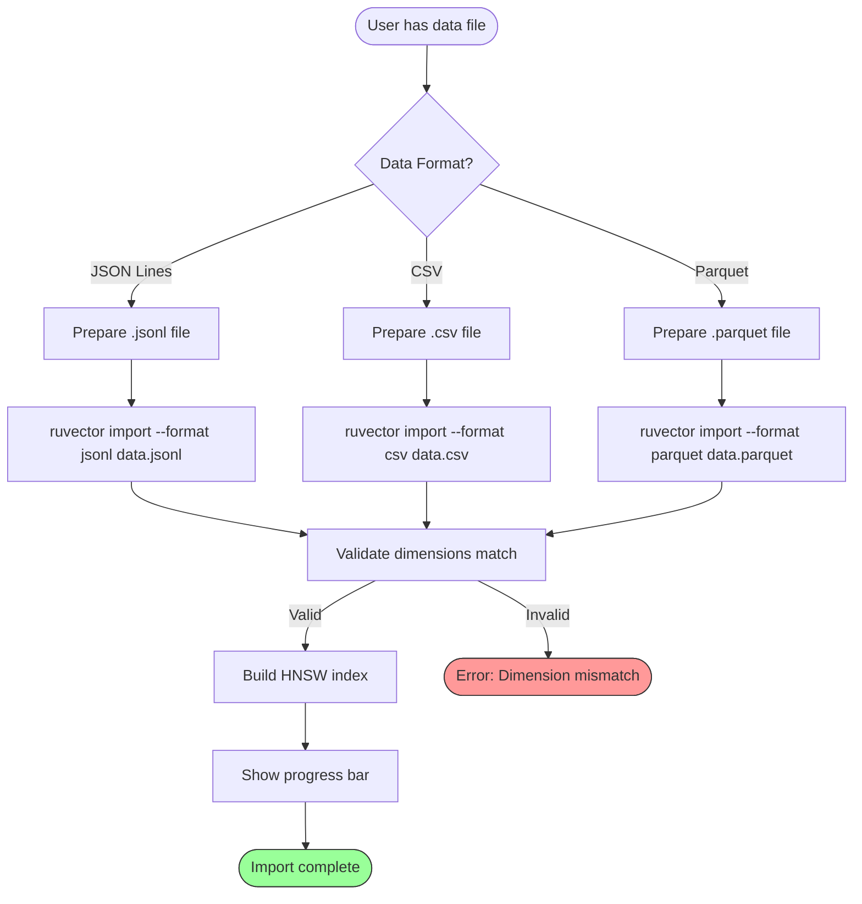
```mermaid
flowchart TD
    Start([User has data file]) --> Format{Data Format?}

    Format -->|JSON Lines| JSONL[Prepare .jsonl file]
    Format -->|CSV| CSV[Prepare .csv file]
    Format -->|Parquet| Parquet[Prepare .parquet file]

    JSONL --> CLI1[ruvector import --format jsonl data.jsonl]
    CSV --> CLI2[ruvector import --format csv data.csv]
    Parquet --> CLI3[ruvector import --format parquet data.parquet]

    CLI1 --> Validate[Validate dimensions match]
    CLI2 --> Validate
    CLI3 --> Validate

    Validate -->|Valid| Index[Build HNSW index]
    Validate -->|Invalid| Error([Error: Dimension mismatch])

    Index --> Progress[Show progress bar]
    Progress --> Complete([Import complete])

    style Complete fill:#9f9,stroke:#333
    style Error fill:#f99,stroke:#333
```

### Flow 4: Export Data

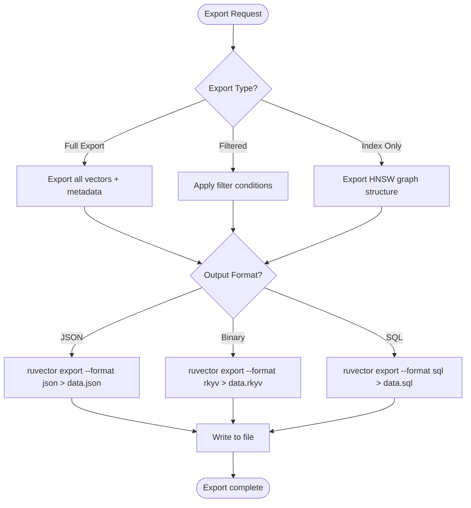
```mermaid
flowchart TD
    Start([Export Request]) --> Type{Export Type?}

    Type -->|Full Export| Full[Export all vectors + metadata]
    Type -->|Filtered| Filter[Apply filter conditions]
    Type -->|Index Only| Index[Export HNSW graph structure]

    Full --> Format{Output Format?}
    Filter --> Format
    Index --> Format

    Format -->|JSON| JSON[ruvector export --format json > data.json]
    Format -->|Binary| Binary[ruvector export --format rkyv > data.rkyv]
    Format -->|SQL| SQL[ruvector export --format sql > data.sql]

    JSON --> Write[Write to file]
    Binary --> Write
    SQL --> Write

    Write --> Complete([Export complete])
```

---

## Developer Flows

### Flow 5: Rust Integration

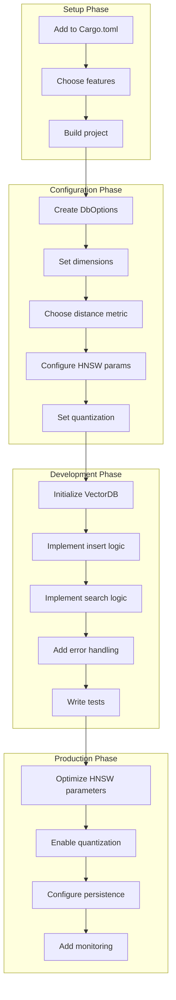
```mermaid
flowchart TD
    subgraph "Setup Phase"
        A1[Add to Cargo.toml] --> A2[Choose features]
        A2 --> A3[Build project]
    end

    subgraph "Configuration Phase"
        B1[Create DbOptions] --> B2[Set dimensions]
        B2 --> B3[Choose distance metric]
        B3 --> B4[Configure HNSW params]
        B4 --> B5[Set quantization]
    end

    subgraph "Development Phase"
        C1[Initialize VectorDB] --> C2[Implement insert logic]
        C2 --> C3[Implement search logic]
        C3 --> C4[Add error handling]
        C4 --> C5[Write tests]
    end

    subgraph "Production Phase"
        D1[Optimize HNSW parameters] --> D2[Enable quantization]
        D2 --> D3[Configure persistence]
        D3 --> D4[Add monitoring]
    end

    A3 --> B1
    B5 --> C1
    C5 --> D1
```

**Code Flow**:

```rust
// 1. Configuration
let options = DbOptions {
    dimensions: 384,
    distance_metric: DistanceMetric::Cosine,
    storage_path: "./vectors.db".to_string(),
    hnsw_config: Some(HnswConfig {
        m: 32,
        ef_construction: 200,
        ef_search: 100,
    }),
    quantization: Some(QuantizationConfig::Scalar),
};

// 2. Initialize
let db = VectorDB::new(options)?;

// 3. Insert
let id = db.insert(VectorEntry {
    id: None,
    vector: embedding,
    metadata: Some(metadata),
})?;

// 4. Search
let results = db.search(SearchQuery {
    vector: query_embedding,
    k: 10,
    filter: Some(filter),
    ef_search: None,
})?;
```

### Flow 6: Node.js Integration

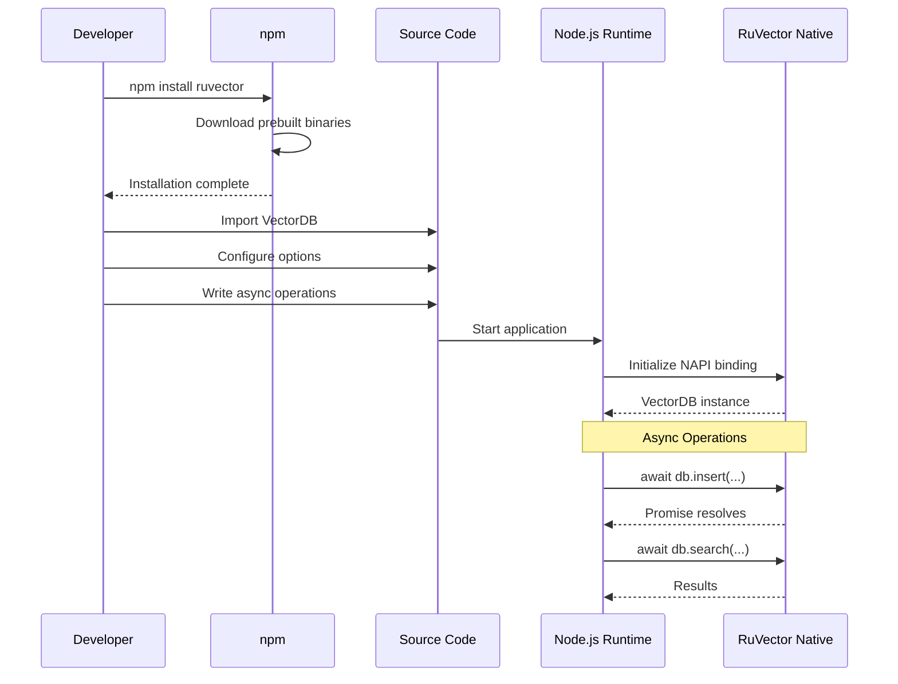
```mermaid
sequenceDiagram
    participant Dev as Developer
    participant NPM as npm
    participant Code as Source Code
    participant Runtime as Node.js Runtime
    participant RuVector as RuVector Native

    Dev->>NPM: npm install ruvector
    NPM->>NPM: Download prebuilt binaries
    NPM-->>Dev: Installation complete

    Dev->>Code: Import VectorDB
    Dev->>Code: Configure options
    Dev->>Code: Write async operations

    Code->>Runtime: Start application
    Runtime->>RuVector: Initialize NAPI binding
    RuVector-->>Runtime: VectorDB instance

    Note over Runtime,RuVector: Async Operations
    Runtime->>RuVector: await db.insert(...)
    RuVector-->>Runtime: Promise resolves
    Runtime->>RuVector: await db.search(...)
    RuVector-->>Runtime: Results
```

### Flow 7: Browser WASM Integration

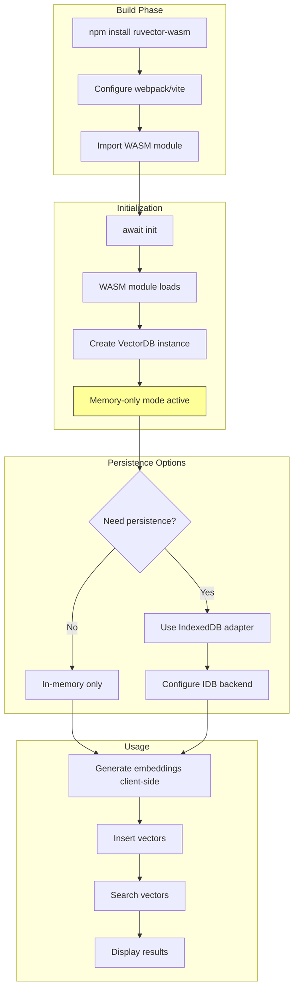
```mermaid
flowchart TD
    subgraph "Build Phase"
        A1[npm install ruvector-wasm] --> A2[Configure webpack/vite]
        A2 --> A3[Import WASM module]
    end

    subgraph "Initialization"
        B1[await init] --> B2[WASM module loads]
        B2 --> B3[Create VectorDB instance]
        B3 --> B4[Memory-only mode active]
    end

    subgraph "Persistence Options"
        C1{Need persistence?}
        C1 -->|Yes| C2[Use IndexedDB adapter]
        C1 -->|No| C3[In-memory only]
        C2 --> C4[Configure IDB backend]
    end

    subgraph "Usage"
        D1[Generate embeddings client-side] --> D2[Insert vectors]
        D2 --> D3[Search vectors]
        D3 --> D4[Display results]
    end

    A3 --> B1
    B4 --> C1
    C3 --> D1
    C4 --> D1

    style B4 fill:#ff9,stroke:#333
```

### Flow 8: CLI Development Workflow

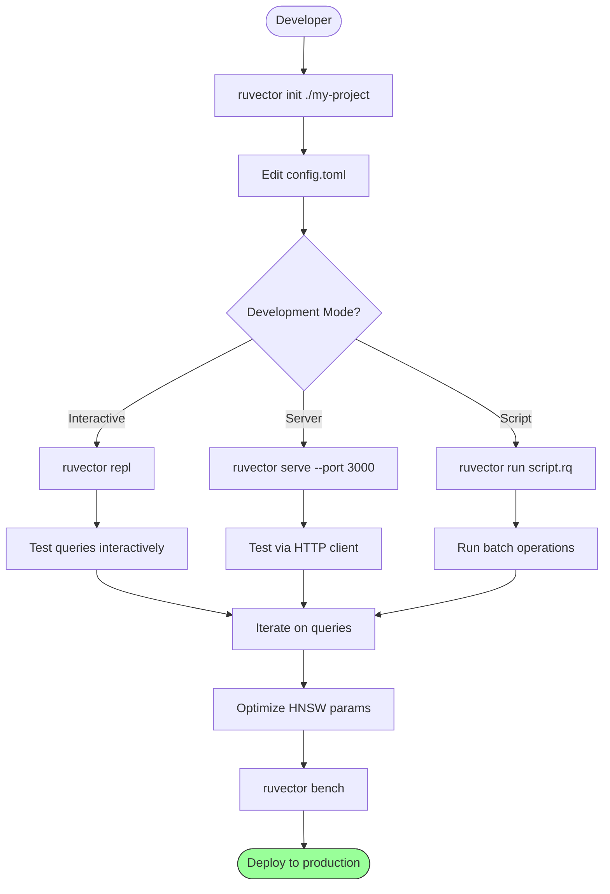
```mermaid
flowchart TD
    Start([Developer]) --> Init[ruvector init ./my-project]
    Init --> Config[Edit config.toml]

    Config --> REPL{Development Mode?}
    REPL -->|Interactive| R1[ruvector repl]
    REPL -->|Server| R2[ruvector serve --port 3000]
    REPL -->|Script| R3[ruvector run script.rq]

    R1 --> Test[Test queries interactively]
    R2 --> HTTP[Test via HTTP client]
    R3 --> Batch[Run batch operations]

    Test --> Iterate[Iterate on queries]
    HTTP --> Iterate
    Batch --> Iterate

    Iterate --> Optimize[Optimize HNSW params]
    Optimize --> Benchmark[ruvector bench]
    Benchmark --> Deploy([Deploy to production])

    style Deploy fill:#9f9,stroke:#333
```

---

## Production Flows

### Flow 9: Single Node Production Deployment

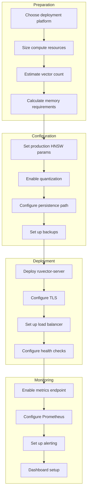
```mermaid
flowchart TD
    subgraph "Preparation"
        A1[Choose deployment platform] --> A2[Size compute resources]
        A2 --> A3[Estimate vector count]
        A3 --> A4[Calculate memory requirements]
    end

    subgraph "Configuration"
        B1[Set production HNSW params] --> B2[Enable quantization]
        B2 --> B3[Configure persistence path]
        B3 --> B4[Set up backups]
    end

    subgraph "Deployment"
        C1[Deploy ruvector-server] --> C2[Configure TLS]
        C2 --> C3[Set up load balancer]
        C3 --> C4[Configure health checks]
    end

    subgraph "Monitoring"
        D1[Enable metrics endpoint] --> D2[Configure Prometheus]
        D2 --> D3[Set up alerting]
        D3 --> D4[Dashboard setup]
    end

    A4 --> B1
    B4 --> C1
    C4 --> D1
```

**Memory Calculation**:

```
Memory = (num_vectors × 640 bytes) / compression_ratio

Example: 10M vectors, 128D, M=32, Scalar Quantization
= (10,000,000 × 640) / 4
= 1.6 GB
```

### Flow 10: Distributed Cluster Deployment

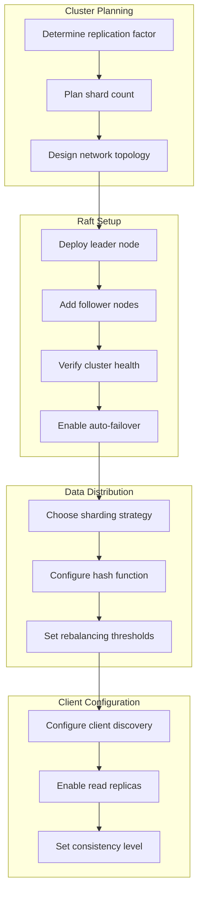
```mermaid
flowchart TD
    subgraph "Cluster Planning"
        A1[Determine replication factor] --> A2[Plan shard count]
        A2 --> A3[Design network topology]
    end

    subgraph "Raft Setup"
        B1[Deploy leader node] --> B2[Add follower nodes]
        B2 --> B3[Verify cluster health]
        B3 --> B4[Enable auto-failover]
    end

    subgraph "Data Distribution"
        C1[Choose sharding strategy] --> C2[Configure hash function]
        C2 --> C3[Set rebalancing thresholds]
    end

    subgraph "Client Configuration"
        D1[Configure client discovery] --> D2[Enable read replicas]
        D2 --> D3[Set consistency level]
    end

    A3 --> B1
    B4 --> C1
    C3 --> D1
```

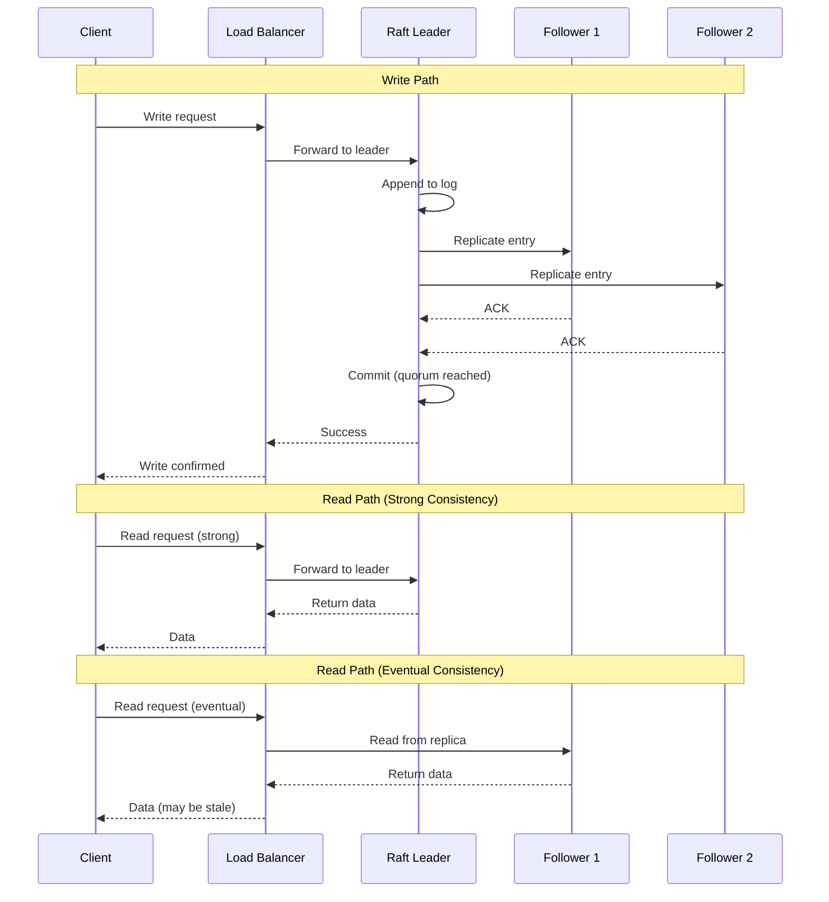
```mermaid
sequenceDiagram
    participant Client
    participant LB as Load Balancer
    participant Leader as Raft Leader
    participant F1 as Follower 1
    participant F2 as Follower 2

    Note over Client,F2: Write Path
    Client->>LB: Write request
    LB->>Leader: Forward to leader
    Leader->>Leader: Append to log
    Leader->>F1: Replicate entry
    Leader->>F2: Replicate entry
    F1-->>Leader: ACK
    F2-->>Leader: ACK
    Leader->>Leader: Commit (quorum reached)
    Leader-->>LB: Success
    LB-->>Client: Write confirmed

    Note over Client,F2: Read Path (Strong Consistency)
    Client->>LB: Read request (strong)
    LB->>Leader: Forward to leader
    Leader-->>LB: Return data
    LB-->>Client: Data

    Note over Client,F2: Read Path (Eventual Consistency)
    Client->>LB: Read request (eventual)
    LB->>F1: Read from replica
    F1-->>LB: Return data
    LB-->>Client: Data (may be stale)
```

### Flow 11: Backup and Recovery

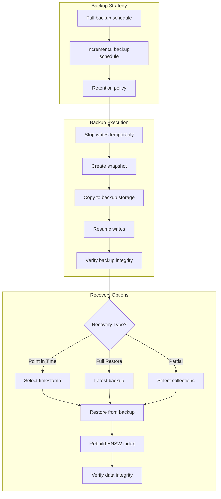
```mermaid
flowchart TD
    subgraph "Backup Strategy"
        A1[Full backup schedule] --> A2[Incremental backup schedule]
        A2 --> A3[Retention policy]
    end

    subgraph "Backup Execution"
        B1[Stop writes temporarily] --> B2[Create snapshot]
        B2 --> B3[Copy to backup storage]
        B3 --> B4[Resume writes]
        B4 --> B5[Verify backup integrity]
    end

    subgraph "Recovery Options"
        C1{Recovery Type?}
        C1 -->|Point in Time| C2[Select timestamp]
        C1 -->|Full Restore| C3[Latest backup]
        C1 -->|Partial| C4[Select collections]

        C2 --> C5[Restore from backup]
        C3 --> C5
        C4 --> C5

        C5 --> C6[Rebuild HNSW index]
        C6 --> C7[Verify data integrity]
    end

    A3 --> B1
    B5 --> C1
```

---

## AI Agent Flows

### Flow 12: RAG (Retrieval-Augmented Generation)

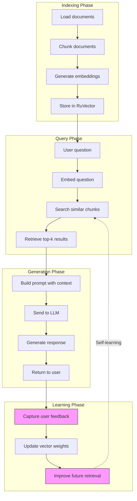
```mermaid
flowchart TD
    subgraph "Indexing Phase"
        A1[Load documents] --> A2[Chunk documents]
        A2 --> A3[Generate embeddings]
        A3 --> A4[Store in RuVector]
    end

    subgraph "Query Phase"
        B1[User question] --> B2[Embed question]
        B2 --> B3[Search similar chunks]
        B3 --> B4[Retrieve top-k results]
    end

    subgraph "Generation Phase"
        C1[Build prompt with context] --> C2[Send to LLM]
        C2 --> C3[Generate response]
        C3 --> C4[Return to user]
    end

    subgraph "Learning Phase"
        D1[Capture user feedback] --> D2[Update vector weights]
        D2 --> D3[Improve future retrieval]
    end

    A4 --> B1
    B4 --> C1
    C4 --> D1
    D3 -.->|Self-learning| B3

    style D1 fill:#f9f,stroke:#333
    style D3 fill:#f9f,stroke:#333
```

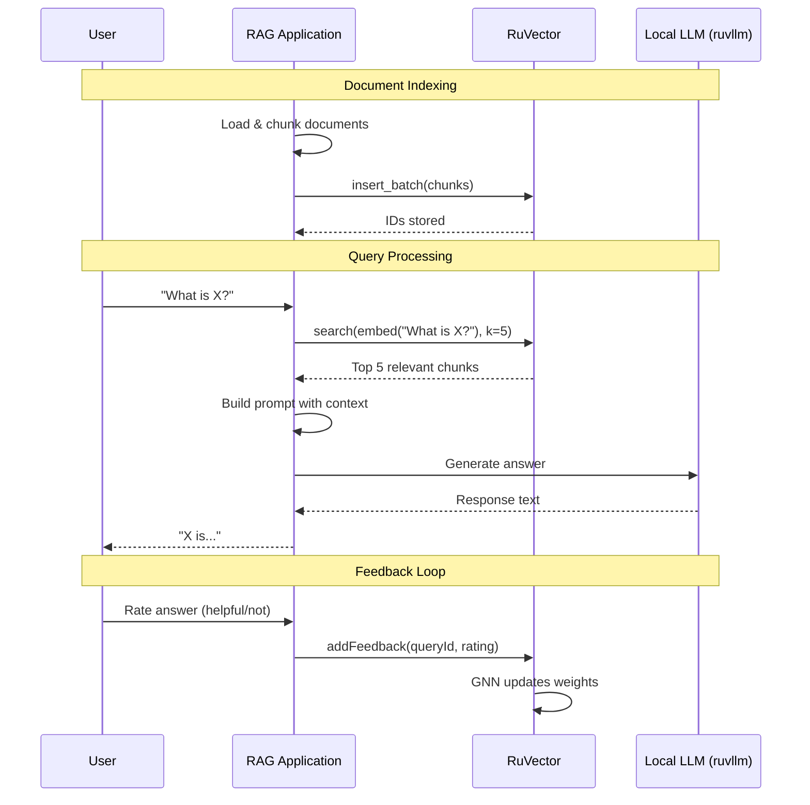
```mermaid
sequenceDiagram
    participant User
    participant App as RAG Application
    participant RuVector
    participant LLM as Local LLM (ruvllm)

    Note over User,LLM: Document Indexing
    App->>App: Load & chunk documents
    App->>RuVector: insert_batch(chunks)
    RuVector-->>App: IDs stored

    Note over User,LLM: Query Processing
    User->>App: "What is X?"
    App->>RuVector: search(embed("What is X?"), k=5)
    RuVector-->>App: Top 5 relevant chunks

    App->>App: Build prompt with context
    App->>LLM: Generate answer
    LLM-->>App: Response text
    App-->>User: "X is..."

    Note over User,LLM: Feedback Loop
    User->>App: Rate answer (helpful/not)
    App->>RuVector: addFeedback(queryId, rating)
    RuVector->>RuVector: GNN updates weights
```

### Flow 13: Agent Memory System (AgenticDB)

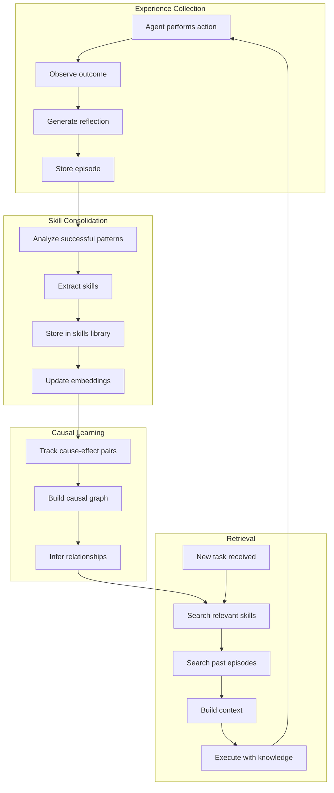
```mermaid
flowchart TD
    subgraph "Experience Collection"
        A1[Agent performs action] --> A2[Observe outcome]
        A2 --> A3[Generate reflection]
        A3 --> A4[Store episode]
    end

    subgraph "Skill Consolidation"
        B1[Analyze successful patterns] --> B2[Extract skills]
        B2 --> B3[Store in skills library]
        B3 --> B4[Update embeddings]
    end

    subgraph "Causal Learning"
        C1[Track cause-effect pairs] --> C2[Build causal graph]
        C2 --> C3[Infer relationships]
    end

    subgraph "Retrieval"
        D1[New task received] --> D2[Search relevant skills]
        D2 --> D3[Search past episodes]
        D3 --> D4[Build context]
        D4 --> D5[Execute with knowledge]
    end

    A4 --> B1
    B4 --> C1
    C3 --> D2
    D5 --> A1
```

### Flow 14: Multi-Agent Coordination

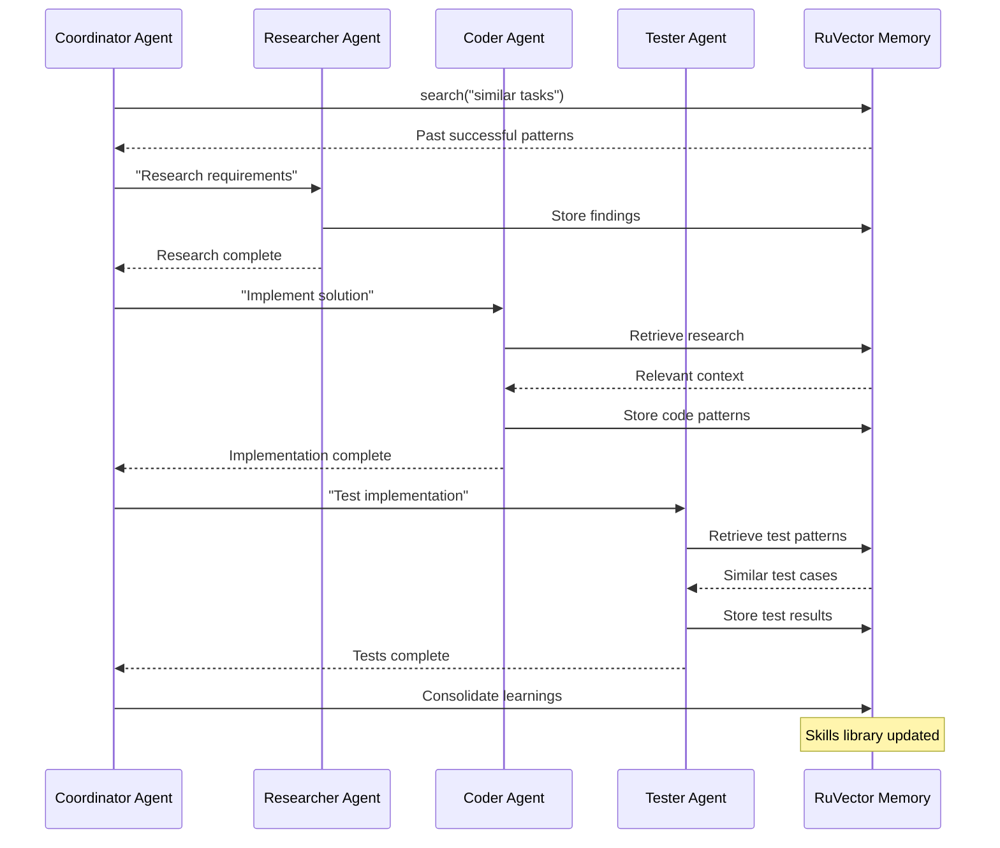
```mermaid
sequenceDiagram
    participant Coord as Coordinator Agent
    participant R as Researcher Agent
    participant C as Coder Agent
    participant T as Tester Agent
    participant Memory as RuVector Memory

    Coord->>Memory: search("similar tasks")
    Memory-->>Coord: Past successful patterns

    Coord->>R: "Research requirements"
    R->>Memory: Store findings
    R-->>Coord: Research complete

    Coord->>C: "Implement solution"
    C->>Memory: Retrieve research
    Memory-->>C: Relevant context
    C->>Memory: Store code patterns
    C-->>Coord: Implementation complete

    Coord->>T: "Test implementation"
    T->>Memory: Retrieve test patterns
    Memory-->>T: Similar test cases
    T->>Memory: Store test results
    T-->>Coord: Tests complete

    Coord->>Memory: Consolidate learnings
    Note over Memory: Skills library updated
```

### Flow 15: SONA Self-Optimizing Routing

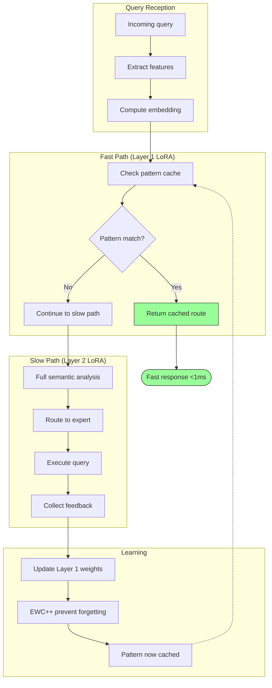
```mermaid
flowchart TD
    subgraph "Query Reception"
        A1[Incoming query] --> A2[Extract features]
        A2 --> A3[Compute embedding]
    end

    subgraph "Fast Path (Layer 1 LoRA)"
        B1[Check pattern cache] --> B2{Pattern match?}
        B2 -->|Yes| B3[Return cached route]
        B2 -->|No| B4[Continue to slow path]
    end

    subgraph "Slow Path (Layer 2 LoRA)"
        C1[Full semantic analysis] --> C2[Route to expert]
        C2 --> C3[Execute query]
        C3 --> C4[Collect feedback]
    end

    subgraph "Learning"
        D1[Update Layer 1 weights] --> D2[EWC++ prevent forgetting]
        D2 --> D3[Pattern now cached]
    end

    A3 --> B1
    B3 --> E1([Fast response <1ms])
    B4 --> C1
    C4 --> D1
    D3 -.-> B1

    style B3 fill:#9f9,stroke:#333
    style E1 fill:#9f9,stroke:#333
```

---

## Integration Flows

### Flow 16: MCP (Model Context Protocol) Integration

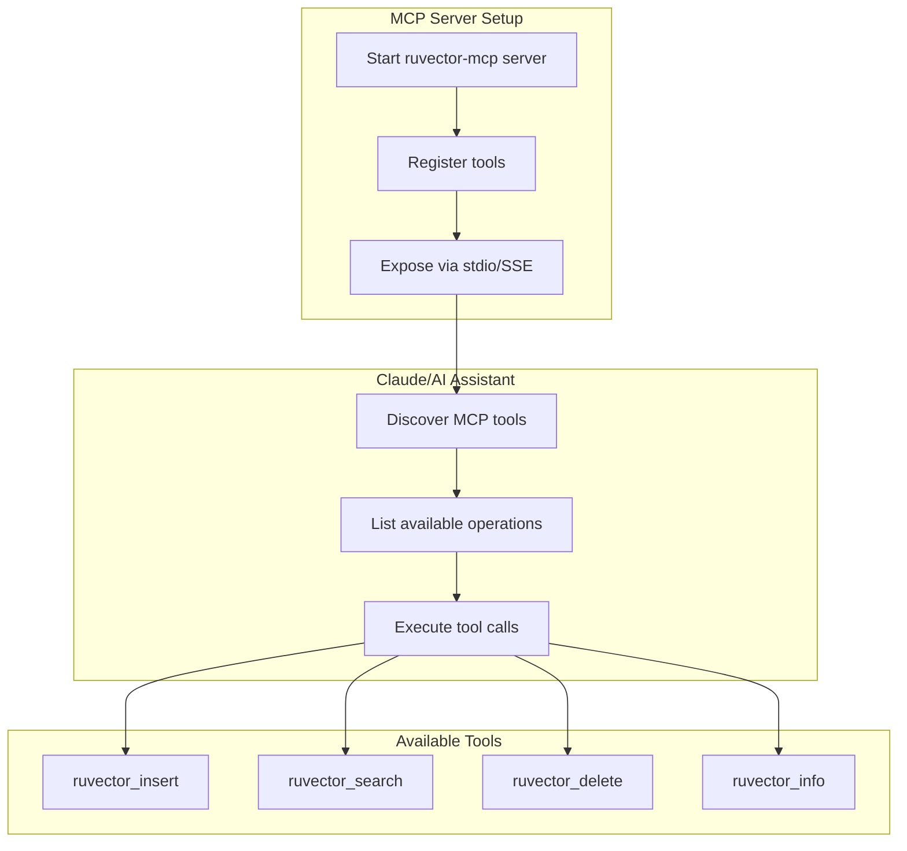
```mermaid
flowchart TD
    subgraph "MCP Server Setup"
        A1[Start ruvector-mcp server] --> A2[Register tools]
        A2 --> A3[Expose via stdio/SSE]
    end

    subgraph "Claude/AI Assistant"
        B1[Discover MCP tools] --> B2[List available operations]
        B2 --> B3[Execute tool calls]
    end

    subgraph "Available Tools"
        C1[ruvector_insert]
        C2[ruvector_search]
        C3[ruvector_delete]
        C4[ruvector_info]
    end

    A3 --> B1
    B3 --> C1
    B3 --> C2
    B3 --> C3
    B3 --> C4
```

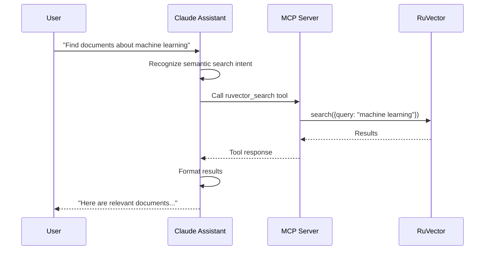
```mermaid
sequenceDiagram
    participant User
    participant Claude as Claude Assistant
    participant MCP as MCP Server
    participant RuVector

    User->>Claude: "Find documents about machine learning"
    Claude->>Claude: Recognize semantic search intent
    Claude->>MCP: Call ruvector_search tool
    MCP->>RuVector: search({query: "machine learning"})
    RuVector-->>MCP: Results
    MCP-->>Claude: Tool response
    Claude->>Claude: Format results
    Claude-->>User: "Here are relevant documents..."
```

### Flow 17: PostgreSQL Extension Integration

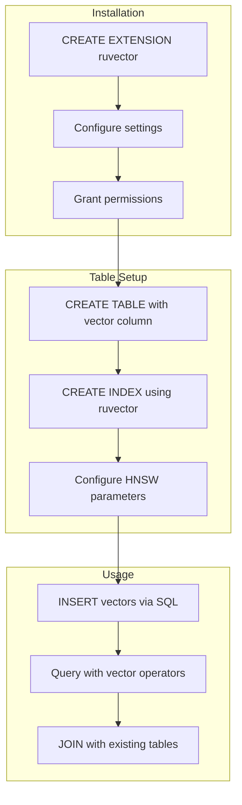
```mermaid
flowchart TD
    subgraph "Installation"
        A1[CREATE EXTENSION ruvector] --> A2[Configure settings]
        A2 --> A3[Grant permissions]
    end

    subgraph "Table Setup"
        B1[CREATE TABLE with vector column] --> B2[CREATE INDEX using ruvector]
        B2 --> B3[Configure HNSW parameters]
    end

    subgraph "Usage"
        C1[INSERT vectors via SQL] --> C2[Query with vector operators]
        C2 --> C3[JOIN with existing tables]
    end

    A3 --> B1
    B3 --> C1
```

```sql
-- PostgreSQL Integration Example
CREATE EXTENSION ruvector;

CREATE TABLE documents (
    id SERIAL PRIMARY KEY,
    content TEXT,
    embedding VECTOR(384)
);

CREATE INDEX ON documents
USING ruvector (embedding vector_cosine_ops)
WITH (m = 32, ef_construction = 200);

-- Insert
INSERT INTO documents (content, embedding)
VALUES ('Hello world', '[0.1, 0.2, ...]'::vector);

-- Semantic search
SELECT content, embedding <=> '[0.15, 0.25, ...]' AS distance
FROM documents
ORDER BY embedding <=> '[0.15, 0.25, ...]'
LIMIT 10;
```

### Flow 18: Claude-Flow Integration

```mermaid
flowchart TD
    subgraph "Claude-Flow Orchestration"
        A1[Initialize swarm] --> A2[Spawn agents]
        A2 --> A3[Coordinate tasks]
    end

    subgraph "RuVector Memory Layer"
        B1[SONA routing] --> B2[HNSW pattern search]
        B2 --> B3[Agent memory storage]
        B3 --> B4[Skill consolidation]
    end

    subgraph "Agent Types"
        C1[Researcher] --> B1
        C2[Coder] --> B1
        C3[Tester] --> B1
        C4[Reviewer] --> B1
    end

    A3 --> C1
    A3 --> C2
    A3 --> C3
    A3 --> C4

    B4 --> A3
```

### Flow 19: Hybrid Search Flow

```mermaid
flowchart TD
    subgraph "Query Processing"
        A1[User query] --> A2[Extract keywords]
        A2 --> A3[Generate embedding]
    end

    subgraph "Dual Search"
        B1[BM25 keyword search] --> B3[Keyword results]
        B2[Vector semantic search] --> B4[Semantic results]
    end

    subgraph "Fusion"
        C1[Reciprocal Rank Fusion] --> C2[Re-rank combined results]
        C2 --> C3[Apply diversity filter MMR]
    end

    subgraph "Output"
        D1[Return top-k diverse results]
    end

    A2 --> B1
    A3 --> B2
    B3 --> C1
    B4 --> C1
    C3 --> D1
```

### Flow 20: Edge Deployment Flow (WASM)

```mermaid
flowchart TD
    subgraph "Build"
        A1[Compile to WASM] --> A2[Optimize with wasm-opt]
        A2 --> A3[Bundle with application]
    end

    subgraph "Deploy"
        B1[CDN distribution] --> B2[Browser loads WASM]
        B2 --> B3[Initialize in Web Worker]
    end

    subgraph "Runtime"
        C1[User interaction] --> C2[Embed locally]
        C2 --> C3[Search locally]
        C3 --> C4[Zero network latency]
    end

    subgraph "Sync Optional"
        D1[Periodic sync to server] --> D2[Merge updates]
    end

    A3 --> B1
    B3 --> C1
    C4 --> D1
```

---

## Summary Matrix

| Flow | Complexity | Primary User | Key Benefit |
|------|------------|--------------|-------------|
| First-Time Setup | Low | All | Quick start |
| Basic Operations | Low | Developers | Core functionality |
| Batch Import | Medium | Data Engineers | Bulk loading |
| Rust Integration | Medium | Rust Developers | Maximum performance |
| Node.js Integration | Low | JS Developers | Familiar ecosystem |
| WASM Integration | Medium | Web Developers | Browser deployment |
| CLI Workflow | Low | All | Development speed |
| Single Node Deploy | Medium | DevOps | Production readiness |
| Distributed Cluster | High | Enterprise | Scale & reliability |
| Backup/Recovery | Medium | Operations | Data protection |
| RAG | Medium | AI Engineers | LLM augmentation |
| Agent Memory | High | AI Researchers | Learning agents |
| Multi-Agent | High | AI Architects | Coordination |
| SONA Routing | High | ML Engineers | Self-optimization |
| MCP Integration | Low | AI Users | Tool augmentation |
| PostgreSQL | Medium | Database Admins | SQL compatibility |
| Claude-Flow | High | AI Teams | Orchestration |
| Hybrid Search | Medium | Search Engineers | Relevance |
| Edge Deployment | Medium | Mobile Developers | Offline capability |
