# RuVector Architecture Report

## Executive Summary

RuVector implements a four-layer architecture designed for high-performance vector operations with self-learning capabilities. This document provides a comprehensive technical overview of the system architecture, component interactions, and design decisions.

---

## System Architecture Overview

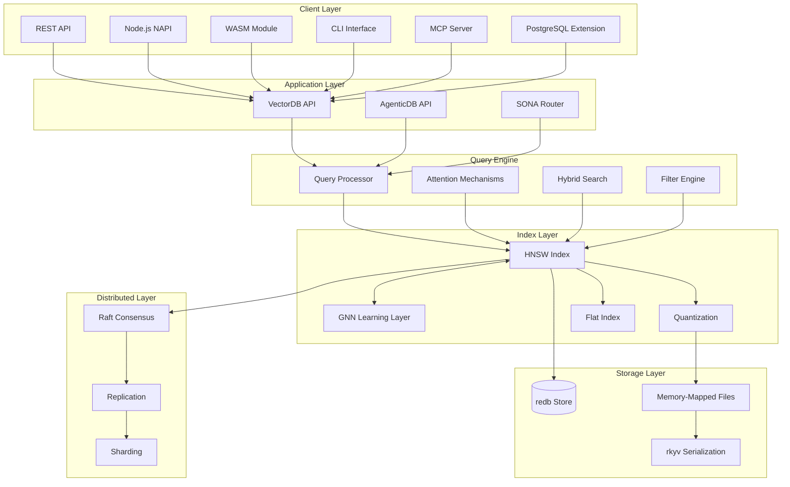

---

## Layer 1: Storage Layer

### Purpose
Persistent, crash-safe storage with zero-copy access patterns.

### Components

#### 1.1 redb (ACID Metadata Store)

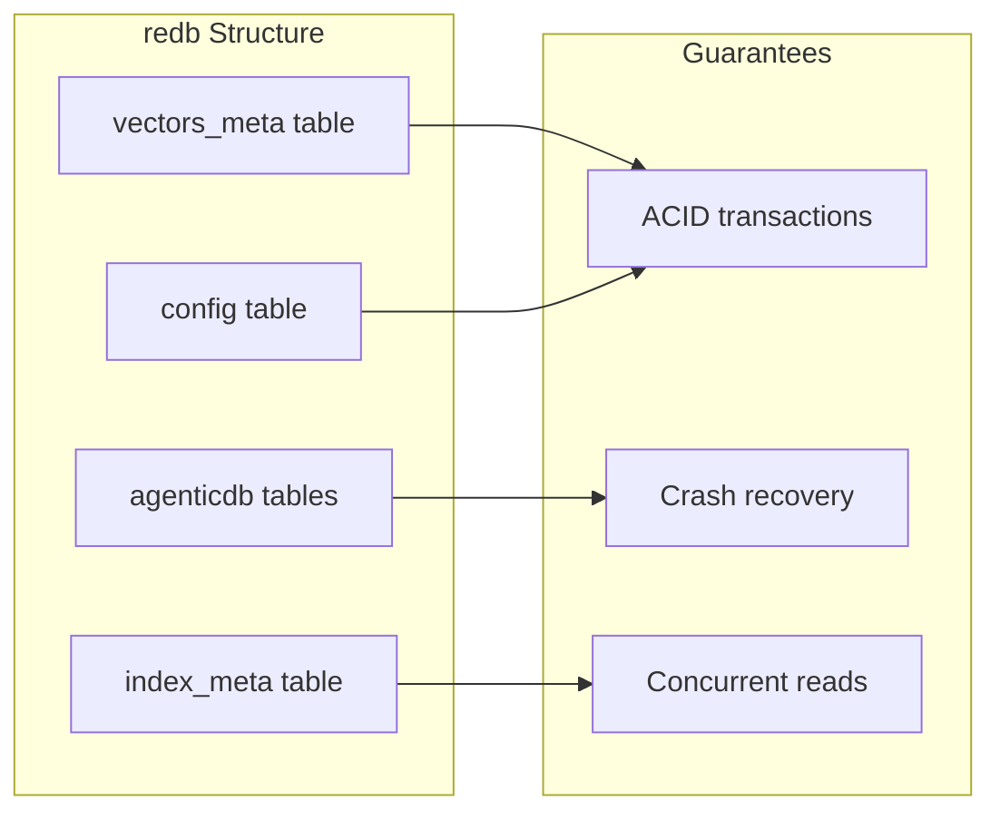

**Data Stored**:
- Vector IDs and metadata
- HNSW configuration
- AgenticDB 5-table schema
- Index build parameters

#### 1.2 Memory-Mapped Vectors (memmap2)

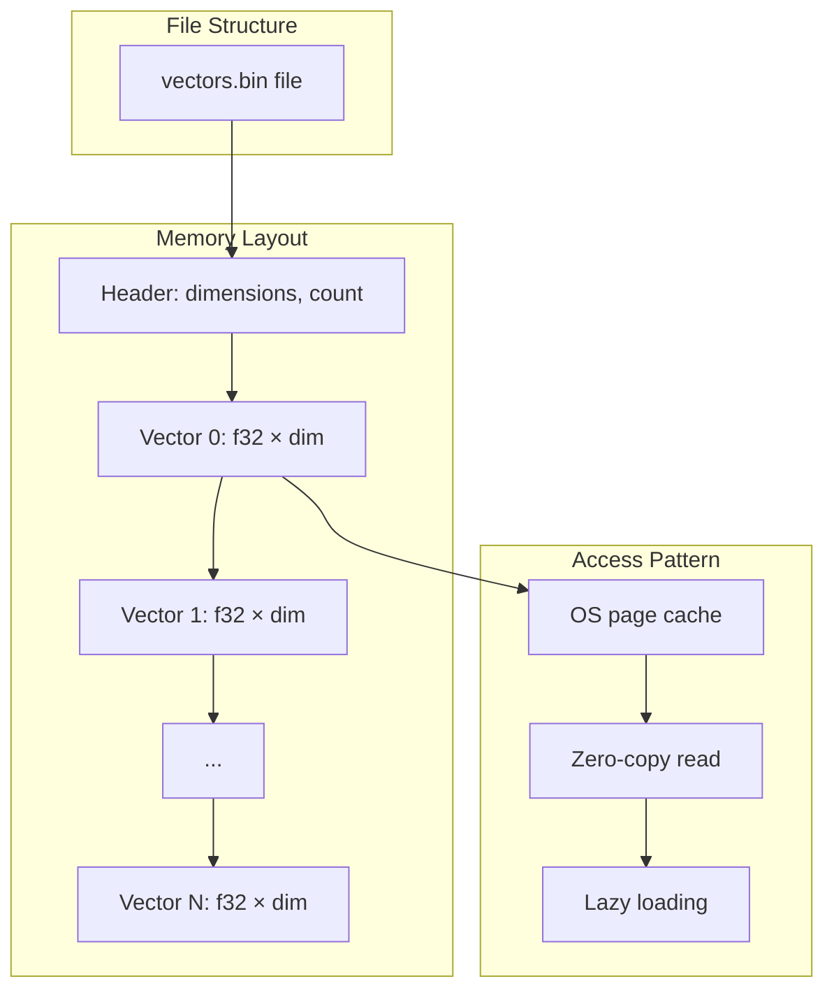

**Benefits**:
- Supports datasets larger than RAM
- No deserialization overhead
- OS manages caching

#### 1.3 rkyv (Zero-Copy Serialization)

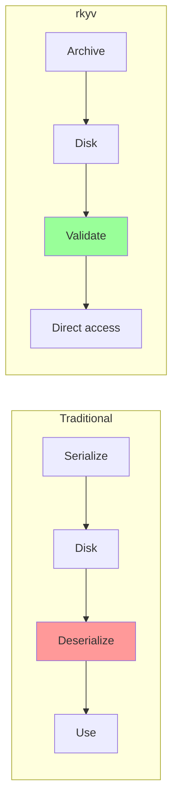

**Performance**:
- Sub-second index loading for billions of vectors
- In-place access without copying
- Validation-only overhead

---

## Layer 2: Index Layer

### Purpose
Fast approximate nearest neighbor (ANN) search with learning capability.

### Components

#### 2.1 HNSW (Hierarchical Navigable Small World)

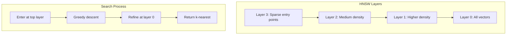

**Parameters**:

| Parameter | Description | Default | Impact |
|-----------|-------------|---------|--------|
| M | Connections per node | 32 | Memory vs recall |
| ef_construction | Build-time candidates | 200 | Build speed vs quality |
| ef_search | Search-time candidates | 100 | Latency vs recall |

**Complexity**:
- Build: O(n × log(n))
- Search: O(log(n))
- Memory: ~640 bytes per vector (M=32, 128D)

#### 2.2 GNN Learning Layer

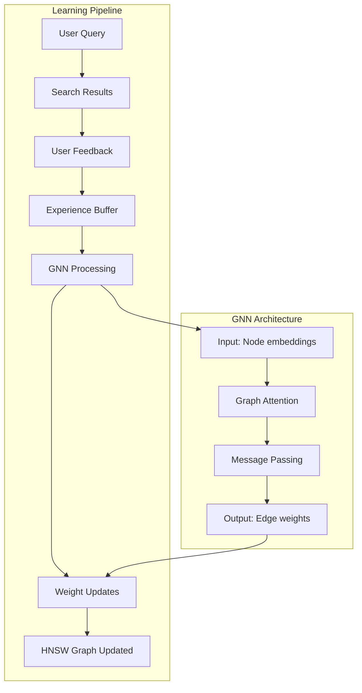

**Learning Mechanism**:
1. Observe which results users click/rate
2. Store as (query, positive, negative) tuples
3. GNN learns to predict edge importance
4. HNSW graph edges reweighted
5. Future searches improved

#### 2.3 Quantization

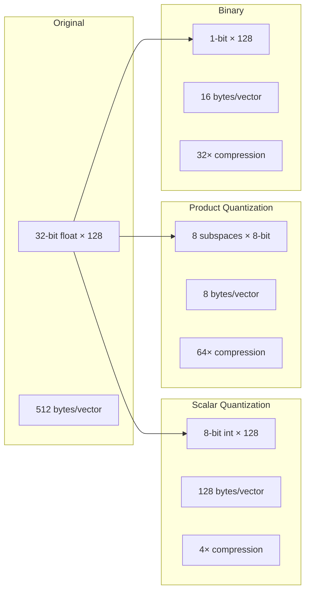

---

## Layer 3: Query Engine

### Purpose
Advanced query processing with multiple search strategies.

### Components

#### 3.1 Distance Metrics (SIMD-Optimized)

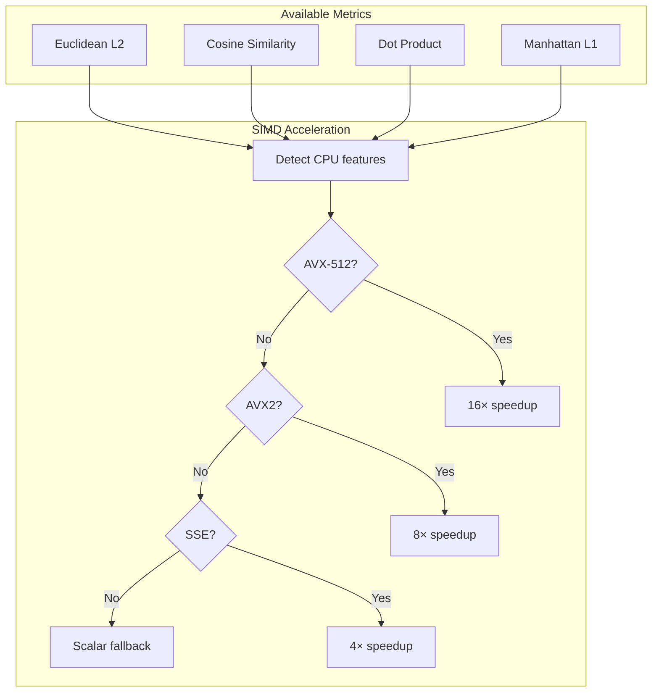

#### 3.2 Attention Mechanisms (39 Types)

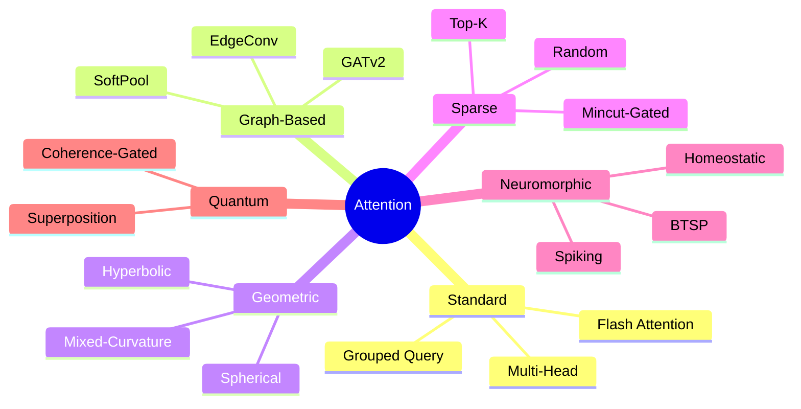

#### 3.3 Hybrid Search

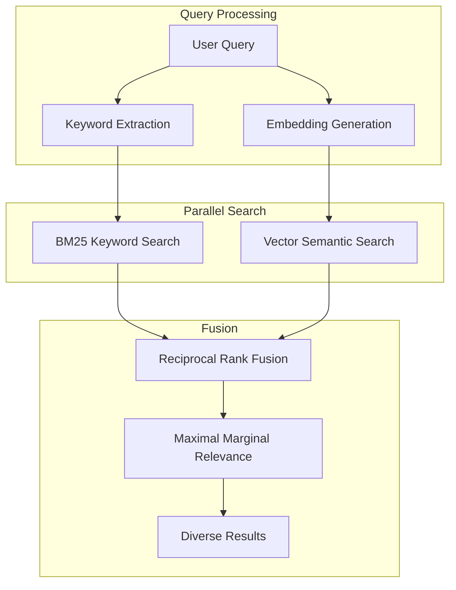

---

## Layer 4: Application Layer

### Purpose
User-facing APIs and AI integration.

### Components

#### 4.1 VectorDB API

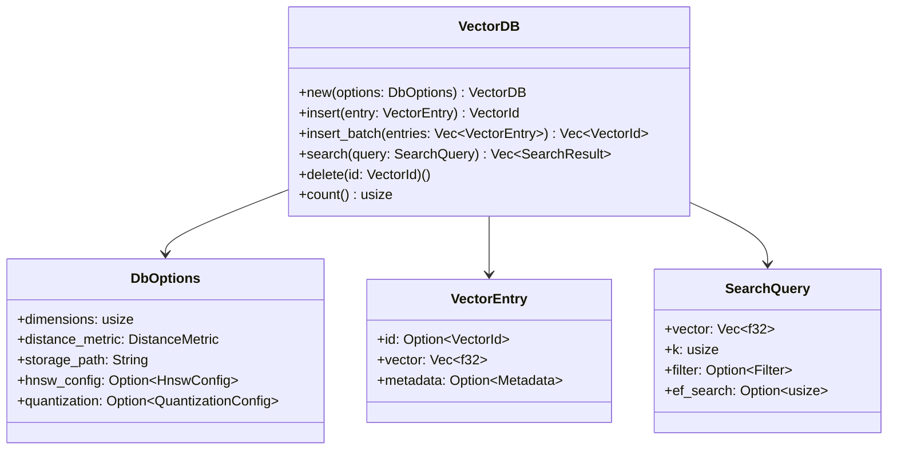

#### 4.2 AgenticDB Schema

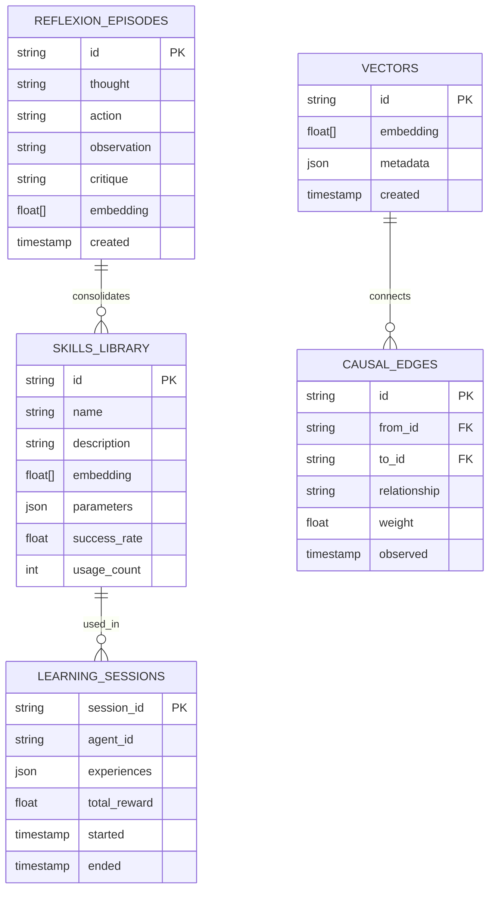

#### 4.3 SONA Self-Optimizing Router

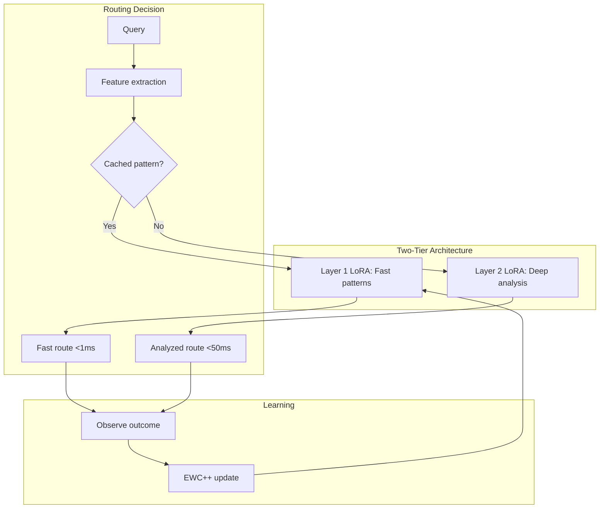

---

## Distributed Architecture

### Raft Consensus

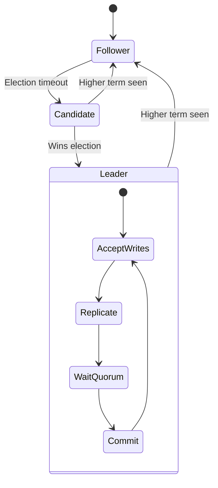

### Sharding Strategy

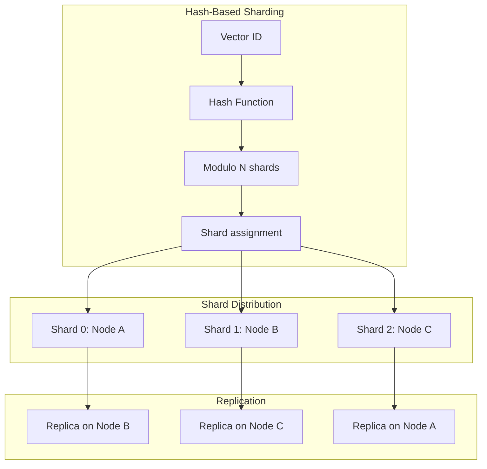

---

## Crate Dependency Graph

```mermaid
flowchart TD
    subgraph "Core"
        C[ruvector-core]
    end

    subgraph "Bindings"
        N[ruvector-node]
        W[ruvector-wasm]
        CLI[ruvector-cli]
        PG[ruvector-postgres]
    end

    subgraph "Advanced Features"
        G[ruvector-graph]
        GNN[ruvector-gnn]
        ATT[ruvector-attention]
        MC[ruvector-mincut]
    end

    subgraph "Distributed"
        RAFT[ruvector-raft]
        REP[ruvector-replication]
        CLUS[ruvector-cluster]
    end

    subgraph "Learning"
        SONA[sona]
        ROUTE[ruvector-router-core]
        LEARN[ruvector-learning-wasm]
    end

    subgraph "LLM"
        LLM[ruvllm]
        LLMC[ruvllm-cli]
        LLMW[ruvllm-wasm]
    end

    N --> C
    W --> C
    CLI --> C
    PG --> C

    G --> C
    GNN --> G
    ATT --> C
    MC --> C

    RAFT --> C
    REP --> RAFT
    CLUS --> REP

    SONA --> C
    ROUTE --> SONA
    LEARN --> ROUTE

    LLM --> C
    LLMC --> LLM
    LLMW --> LLM
```

---

## Performance Architecture

### Memory Layout

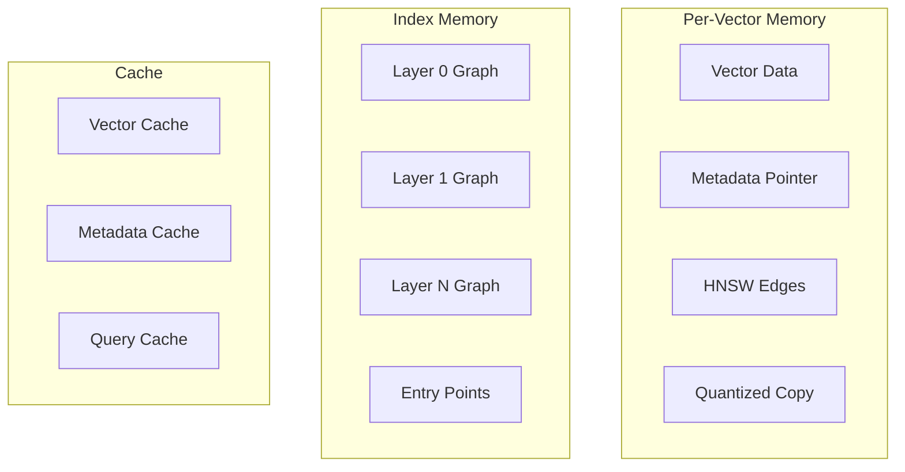

**Memory Formula**:
```
Total Memory =
    vectors × dimensions × sizeof(f32) +          # Raw vectors
    vectors × 640 bytes × M/32 +                  # HNSW graph
    vectors × metadata_avg_size +                 # Metadata
    cache_size                                    # Caches
```

### Parallel Processing

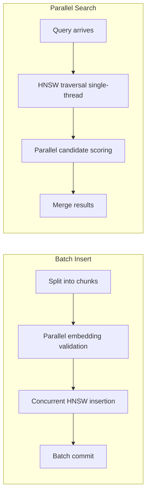

---

## Security Architecture

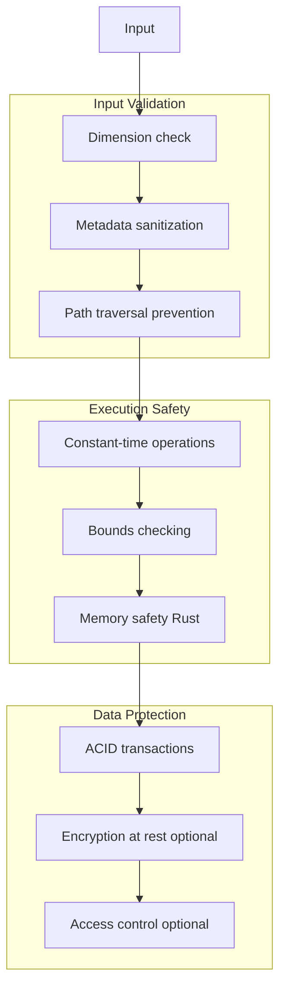

---

## Design Decisions

### Why Rust?

| Decision | Rationale |
|----------|-----------|
| Memory safety | No buffer overflows, use-after-free |
| Zero-cost abstractions | High-level APIs without overhead |
| Fearless concurrency | Data race prevention at compile time |
| FFI support | Easy Node.js/WASM/Python bindings |
| Performance | C/C++ level speed |

### Why HNSW over alternatives?

| Index Type | Search | Build | Memory | Chosen? |
|------------|--------|-------|--------|---------|
| HNSW | O(log n) | O(n log n) | Medium | **Yes** |
| IVF | O(√n) | O(n) | Low | No |
| LSH | O(1) | O(n) | High | No |
| KD-Tree | O(log n) | O(n log n) | Low | No |

HNSW provides the best balance of search speed, recall, and dynamic updates.

### Why rkyv over serde?

| Feature | rkyv | serde |
|---------|------|-------|
| Deserialization | Zero-copy | Full copy |
| Access speed | Immediate | After parse |
| Memory overhead | None | Full object |
| Validation | Optional | Required |

---

## Summary

RuVector's architecture is designed around three key principles:

1. **Performance**: SIMD, zero-copy, parallel processing
2. **Learning**: GNN layer on HNSW enables continuous improvement
3. **Flexibility**: Multiple deployment targets from single codebase

The four-layer design (Storage → Index → Query → Application) provides clean separation of concerns while enabling tight integration for maximum performance.
