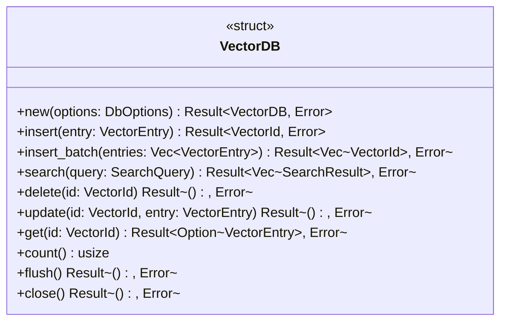
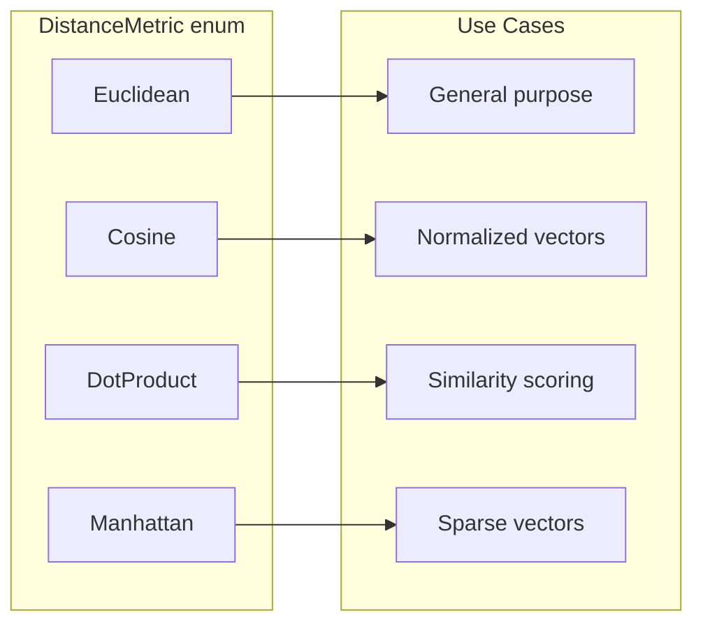
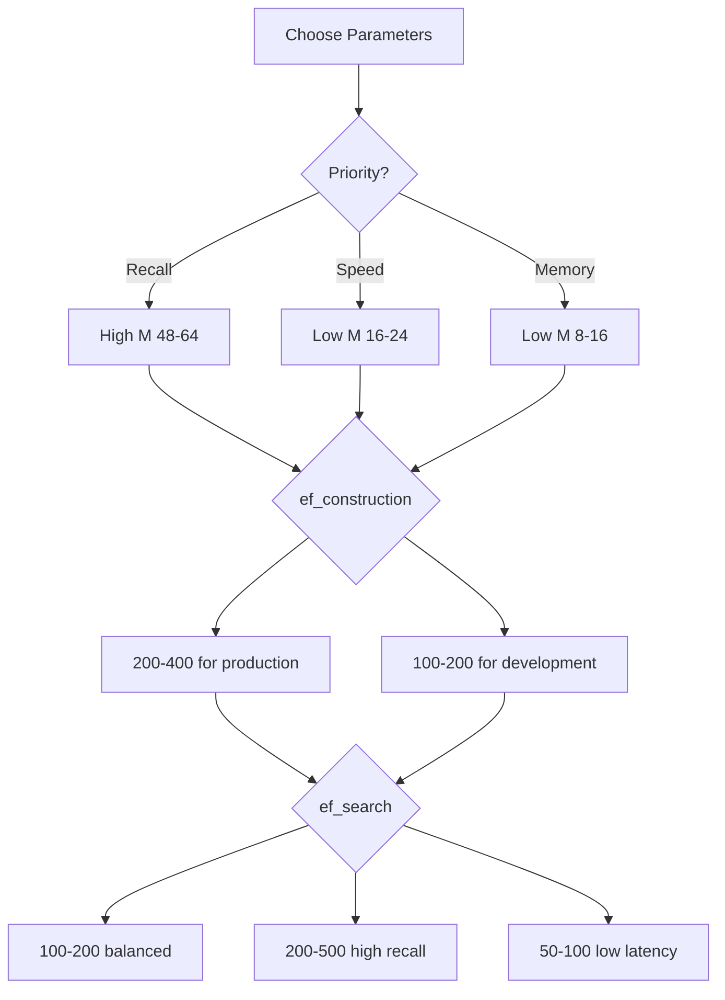
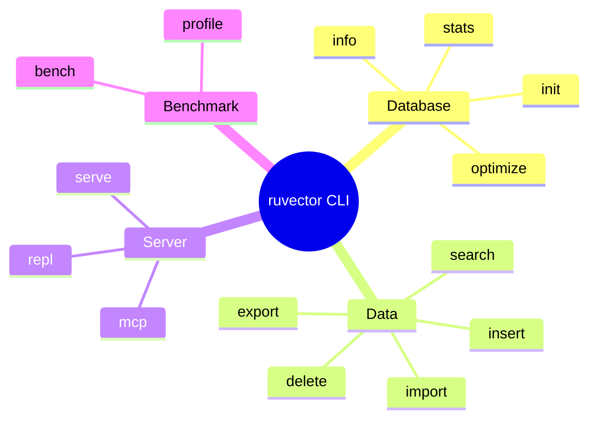
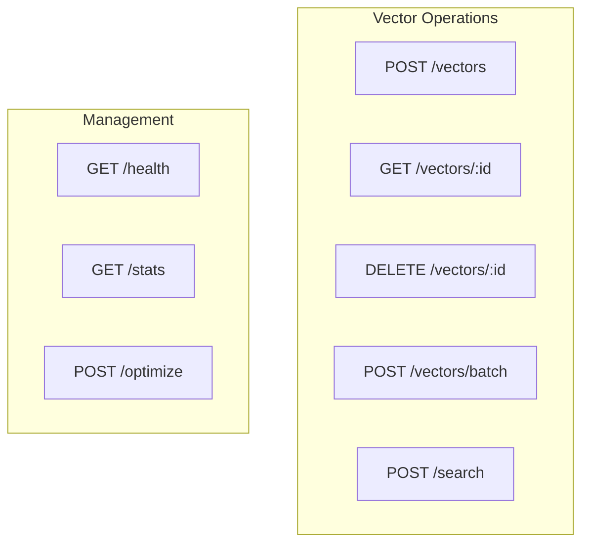
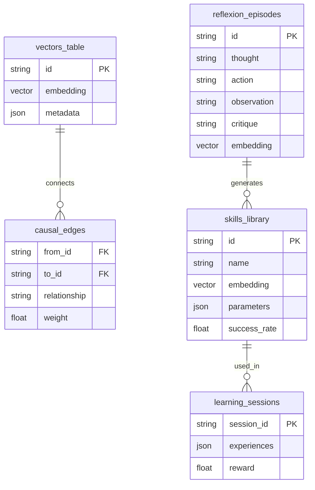

# RuVector API Reference

## Overview

RuVector provides APIs across multiple platforms: Rust, Node.js, WASM, CLI, and PostgreSQL. This document covers all public interfaces.

---

## Table of Contents

1. [Rust Core API](#rust-core-api)
2. [Node.js API](#nodejs-api)
3. [WASM API](#wasm-api)
4. [CLI Commands](#cli-commands)
5. [REST API](#rest-api)
6. [MCP Tools](#mcp-tools)
7. [PostgreSQL Extension](#postgresql-extension)
8. [AgenticDB API](#agenticdb-api)

---

## Rust Core API

### VectorDB

The primary interface for vector operations.



#### Constructor

```rust
pub fn new(options: DbOptions) -> Result<VectorDB, Error>
```

**Parameters**:

| Field | Type | Required | Description |
|-------|------|----------|-------------|
| `dimensions` | `usize` | Yes | Vector dimensionality (1-65536) |
| `distance_metric` | `DistanceMetric` | Yes | Distance function |
| `storage_path` | `String` | Yes | Path for persistence |
| `hnsw_config` | `Option<HnswConfig>` | No | HNSW parameters |
| `quantization` | `Option<QuantizationConfig>` | No | Compression settings |

**Example**:

```rust
let db = VectorDB::new(DbOptions {
    dimensions: 384,
    distance_metric: DistanceMetric::Cosine,
    storage_path: "./vectors.db".to_string(),
    hnsw_config: Some(HnswConfig {
        m: 32,
        ef_construction: 200,
        ef_search: 100,
    }),
    quantization: Some(QuantizationConfig::Scalar),
})?;
```

#### insert

```rust
pub fn insert(&self, entry: VectorEntry) -> Result<VectorId, Error>
```

Insert a single vector with optional metadata.

**Parameters**:

```rust
pub struct VectorEntry {
    pub id: Option<VectorId>,      // Auto-generated if None
    pub vector: Vec<f32>,          // Must match dimensions
    pub metadata: Option<Metadata>, // JSON-compatible data
}
```

**Returns**: Generated or provided `VectorId`

**Example**:

```rust
let id = db.insert(VectorEntry {
    id: None,
    vector: vec![0.1, 0.2, 0.3, /* ... */],
    metadata: Some(json!({
        "text": "Hello world",
        "category": "greeting"
    })),
})?;
```

#### insert_batch

```rust
pub fn insert_batch(&self, entries: Vec<VectorEntry>) -> Result<Vec<VectorId>, Error>
```

Batch insert for better performance. Uses parallel processing internally.

**Performance**: 50-100K ops/sec on modern hardware.

#### search

```rust
pub fn search(&self, query: SearchQuery) -> Result<Vec<SearchResult>, Error>
```

Find k nearest neighbors.

**Parameters**:

```rust
pub struct SearchQuery {
    pub vector: Vec<f32>,                     // Query vector
    pub k: usize,                             // Number of results
    pub filter: Option<HashMap<String, Value>>, // Metadata filters
    pub ef_search: Option<usize>,             // Override HNSW param
    pub include_vector: bool,                 // Return vectors in results
    pub include_metadata: bool,               // Return metadata in results
}
```

**Returns**:

```rust
pub struct SearchResult {
    pub id: VectorId,
    pub score: f32,                          // Distance (lower = closer)
    pub vector: Option<Vec<f32>>,
    pub metadata: Option<Metadata>,
}
```

**Example**:

```rust
let results = db.search(SearchQuery {
    vector: query_embedding,
    k: 10,
    filter: Some(json!({"category": "greeting"})),
    ef_search: Some(200),
    include_vector: false,
    include_metadata: true,
})?;

for result in results {
    println!("ID: {}, Score: {:.4}", result.id, result.score);
}
```

### Distance Metrics



### HnswConfig

```rust
pub struct HnswConfig {
    pub m: usize,              // Connections per node (16-64, default: 32)
    pub ef_construction: usize, // Build-time beam width (100-400, default: 200)
    pub ef_search: usize,       // Search-time beam width (50-500, default: 100)
    pub max_elements: usize,    // Maximum vectors (default: 10M)
}
```

**Tuning Guidelines**:



### QuantizationConfig

```rust
pub enum QuantizationConfig {
    None,                           // Full precision (32-bit float)
    Scalar,                         // 8-bit int (4× compression)
    Product { subspaces: usize, k: usize }, // 8-16× compression
    Binary,                         // 1-bit (32× compression)
}
```

---

## Node.js API

### Installation

```bash
npm install ruvector
```

### TypeScript Types

```typescript
interface DbOptions {
    dimensions: number;
    storagePath: string;
    distanceMetric?: 'euclidean' | 'cosine' | 'dotProduct' | 'manhattan';
    hnsw?: {
        m?: number;
        efConstruction?: number;
        efSearch?: number;
    };
    quantization?: 'none' | 'scalar' | 'binary' | {
        type: 'product';
        subspaces: number;
        k: number;
    };
}

interface VectorEntry {
    id?: string;
    vector: Float32Array | number[];
    metadata?: Record<string, unknown>;
}

interface SearchQuery {
    vector: Float32Array | number[];
    k: number;
    filter?: Record<string, unknown>;
    efSearch?: number;
    includeVector?: boolean;
    includeMetadata?: boolean;
}

interface SearchResult {
    id: string;
    score: number;
    vector?: Float32Array;
    metadata?: Record<string, unknown>;
}
```

### Usage

```typescript
import { VectorDB } from 'ruvector';

// Initialize
const db = new VectorDB({
    dimensions: 384,
    storagePath: './vectors.db',
    distanceMetric: 'cosine',
    hnsw: { m: 32, efConstruction: 200, efSearch: 100 }
});

// Insert
const id = await db.insert({
    vector: new Float32Array([0.1, 0.2, ...]),
    metadata: { text: 'Hello world' }
});

// Batch insert
const ids = await db.insertBatch([
    { vector: [...], metadata: {...} },
    { vector: [...], metadata: {...} }
]);

// Search
const results = await db.search({
    vector: queryEmbedding,
    k: 10,
    filter: { category: 'greeting' },
    includeMetadata: true
});

// Delete
await db.delete(id);

// Count
const count = db.count();

// Close
await db.close();
```

### Error Handling

```typescript
import { VectorDB, RuVectorError } from 'ruvector';

try {
    const db = new VectorDB(options);
    await db.insert(entry);
} catch (error) {
    if (error instanceof RuVectorError) {
        switch (error.code) {
            case 'DIMENSION_MISMATCH':
                console.error('Vector dimensions do not match');
                break;
            case 'NOT_FOUND':
                console.error('Vector not found');
                break;
            case 'STORAGE_ERROR':
                console.error('Persistence error');
                break;
        }
    }
}
```

---

## WASM API

### Installation

```bash
npm install ruvector-wasm
```

### Initialization

```javascript
import init, { VectorDB } from 'ruvector-wasm';

// Initialize WASM module (required before use)
await init();

const db = new VectorDB({
    dimensions: 384,
    distanceMetric: 'cosine'
    // Note: No storagePath in WASM (memory-only or IndexedDB)
});
```

### Differences from Node.js

| Feature | Node.js | WASM |
|---------|---------|------|
| SIMD | Native | WebAssembly SIMD |
| Threading | Multi-threaded | Single-threaded |
| Storage | File system | Memory / IndexedDB |
| Binary size | ~10MB | ~2MB |
| Parallel ops | Yes | Limited |

### IndexedDB Persistence

```javascript
import init, { VectorDB, IndexedDBBackend } from 'ruvector-wasm';

await init();

// Create IndexedDB backend
const storage = await IndexedDBBackend.open('my-vectors');

// Use with VectorDB
const db = new VectorDB({
    dimensions: 384,
    distanceMetric: 'cosine',
    storage: storage
});

// Auto-persists to IndexedDB
await db.insert({ vector: [...] });
```

---

## CLI Commands

### Global Options

```bash
ruvector [OPTIONS] <COMMAND>

Options:
    -c, --config <PATH>    Config file path
    -v, --verbose          Increase verbosity
    -q, --quiet            Suppress output
    --format <FORMAT>      Output format: json, table, plain
```

### Commands



#### init

```bash
ruvector init [OPTIONS] <PATH>

Options:
    -d, --dimensions <N>   Vector dimensions (required)
    -m, --metric <TYPE>    Distance metric: euclidean, cosine, dot, manhattan
    --hnsw-m <N>           HNSW M parameter (default: 32)
    --hnsw-ef <N>          HNSW ef_construction (default: 200)
    --quantization <TYPE>  none, scalar, product, binary
```

#### insert

```bash
ruvector insert [OPTIONS] <DATABASE>

Options:
    --vector <JSON>        Vector as JSON array
    --metadata <JSON>      Metadata as JSON object
    --id <ID>              Explicit ID
    --stdin                Read from stdin (JSON lines)
```

#### search

```bash
ruvector search [OPTIONS] <DATABASE>

Options:
    --vector <JSON>        Query vector (required)
    -k, --top <N>          Number of results (default: 10)
    --filter <JSON>        Metadata filter
    --ef-search <N>        Override ef_search parameter
    --include-vectors      Include vectors in output
```

#### import

```bash
ruvector import [OPTIONS] <DATABASE> <FILE>

Options:
    --format <TYPE>        jsonl, csv, parquet, numpy
    --batch-size <N>       Vectors per batch (default: 1000)
    --vector-column <NAME> Column name for vectors
    --id-column <NAME>     Column name for IDs
```

#### export

```bash
ruvector export [OPTIONS] <DATABASE>

Options:
    --format <TYPE>        jsonl, csv, parquet, rkyv
    --filter <JSON>        Export only matching vectors
    -o, --output <PATH>    Output file (default: stdout)
```

#### serve

```bash
ruvector serve [OPTIONS] <DATABASE>

Options:
    -p, --port <N>         HTTP port (default: 3000)
    -h, --host <ADDR>      Bind address (default: 127.0.0.1)
    --tls-cert <PATH>      TLS certificate
    --tls-key <PATH>       TLS private key
    --cors                 Enable CORS
```

#### mcp

```bash
ruvector mcp [OPTIONS]

Options:
    --transport <TYPE>     stdio, sse (default: stdio)
    --port <N>             Port for SSE transport
    --database <PATH>      Database path
```

#### bench

```bash
ruvector bench [OPTIONS] <DATABASE>

Options:
    -n, --vectors <N>      Number of vectors (default: 10000)
    -q, --queries <N>      Number of queries (default: 1000)
    -k, --top <N>          K for search (default: 10)
    --warmup <N>           Warmup iterations (default: 100)
```

---

## REST API

When running `ruvector serve`, the following endpoints are available.

### Endpoints



### POST /vectors

Insert a single vector.

**Request**:
```json
{
    "id": "optional-custom-id",
    "vector": [0.1, 0.2, 0.3, ...],
    "metadata": {
        "text": "Hello world",
        "category": "greeting"
    }
}
```

**Response**:
```json
{
    "id": "generated-or-provided-id",
    "success": true
}
```

### POST /vectors/batch

Batch insert vectors.

**Request**:
```json
{
    "vectors": [
        { "vector": [...], "metadata": {...} },
        { "vector": [...], "metadata": {...} }
    ]
}
```

**Response**:
```json
{
    "ids": ["id1", "id2", ...],
    "count": 2,
    "success": true
}
```

### POST /search

Search for similar vectors.

**Request**:
```json
{
    "vector": [0.1, 0.2, 0.3, ...],
    "k": 10,
    "filter": {
        "category": "greeting"
    },
    "efSearch": 200,
    "includeVectors": false,
    "includeMetadata": true
}
```

**Response**:
```json
{
    "results": [
        {
            "id": "doc1",
            "score": 0.0234,
            "metadata": { "text": "Hello world" }
        },
        ...
    ],
    "took_ms": 1.23
}
```

### GET /health

Health check endpoint.

**Response**:
```json
{
    "status": "healthy",
    "version": "0.1.0",
    "uptime_seconds": 3600
}
```

### GET /stats

Database statistics.

**Response**:
```json
{
    "vector_count": 1000000,
    "dimensions": 384,
    "distance_metric": "cosine",
    "index_type": "hnsw",
    "memory_usage_bytes": 640000000,
    "storage_size_bytes": 512000000
}
```

---

## MCP Tools

When running as MCP server, these tools are exposed.

### Tool: ruvector_insert

```json
{
    "name": "ruvector_insert",
    "description": "Insert a vector into the database",
    "inputSchema": {
        "type": "object",
        "properties": {
            "vector": {
                "type": "array",
                "items": { "type": "number" },
                "description": "Vector to insert"
            },
            "metadata": {
                "type": "object",
                "description": "Optional metadata"
            },
            "id": {
                "type": "string",
                "description": "Optional ID"
            }
        },
        "required": ["vector"]
    }
}
```

### Tool: ruvector_search

```json
{
    "name": "ruvector_search",
    "description": "Search for similar vectors",
    "inputSchema": {
        "type": "object",
        "properties": {
            "vector": {
                "type": "array",
                "items": { "type": "number" },
                "description": "Query vector"
            },
            "k": {
                "type": "integer",
                "description": "Number of results",
                "default": 10
            },
            "filter": {
                "type": "object",
                "description": "Metadata filter"
            }
        },
        "required": ["vector"]
    }
}
```

### Tool: ruvector_delete

```json
{
    "name": "ruvector_delete",
    "description": "Delete a vector by ID",
    "inputSchema": {
        "type": "object",
        "properties": {
            "id": {
                "type": "string",
                "description": "Vector ID to delete"
            }
        },
        "required": ["id"]
    }
}
```

### Tool: ruvector_info

```json
{
    "name": "ruvector_info",
    "description": "Get database information",
    "inputSchema": {
        "type": "object",
        "properties": {}
    }
}
```

---

## PostgreSQL Extension

### Installation

```sql
CREATE EXTENSION ruvector;
```

### Types

#### VECTOR

```sql
-- Create vector with dimensions
CREATE TABLE documents (
    id SERIAL PRIMARY KEY,
    embedding VECTOR(384)
);

-- Insert
INSERT INTO documents (embedding)
VALUES ('[0.1, 0.2, 0.3, ...]'::vector);

-- From array
INSERT INTO documents (embedding)
VALUES (ARRAY[0.1, 0.2, 0.3, ...]::vector);
```

### Operators

| Operator | Description | Example |
|----------|-------------|---------|
| `<->` | Euclidean distance | `a <-> b` |
| `<=>` | Cosine distance | `a <=> b` |
| `<#>` | Negative dot product | `a <#> b` |

### Index

```sql
-- Create HNSW index
CREATE INDEX ON documents
USING ruvector (embedding vector_cosine_ops)
WITH (
    m = 32,
    ef_construction = 200
);

-- Set search parameter
SET ruvector.ef_search = 100;
```

### Functions

```sql
-- Vector dimensions
SELECT vector_dims(embedding) FROM documents;

-- Vector norm
SELECT vector_norm(embedding) FROM documents;

-- Normalize vector
SELECT l2_normalize(embedding) FROM documents;
```

### Example Queries

```sql
-- K-nearest neighbors
SELECT id, content, embedding <=> query_vector AS distance
FROM documents
ORDER BY embedding <=> query_vector
LIMIT 10;

-- With metadata filter
SELECT id, content
FROM documents
WHERE category = 'tech'
ORDER BY embedding <=> query_vector
LIMIT 10;

-- Hybrid search
SELECT id, content,
       (0.7 * semantic_score + 0.3 * keyword_score) AS combined_score
FROM (
    SELECT id, content,
           1 - (embedding <=> query_vector) AS semantic_score,
           ts_rank(tsv, query) AS keyword_score
    FROM documents
    WHERE tsv @@ query
    ORDER BY embedding <=> query_vector
    LIMIT 100
) sub
ORDER BY combined_score DESC
LIMIT 10;
```

---

## AgenticDB API

Extended API for AI agent training data.

### Tables Schema



### Rust API

```rust
pub struct AgenticDB {
    // ...
}

impl AgenticDB {
    /// Store a reflexion episode
    pub fn store_reflexion_episode(&self, episode: ReflexionEpisode) -> Result<String>

    /// Query similar skills
    pub fn query_skills(&self, embedding: Vec<f32>, k: usize) -> Result<Vec<Skill>>

    /// Add causal relationship
    pub fn add_causal_edge(&self, edge: CausalEdge) -> Result<()>

    /// Store learning experience
    pub fn store_experience(&self, session: &str, exp: Experience) -> Result<()>

    /// Consolidate skills from episodes
    pub fn consolidate_skills(&self, threshold: f32) -> Result<Vec<Skill>>
}
```

### Types

```rust
pub struct ReflexionEpisode {
    pub thought: String,
    pub action: String,
    pub observation: String,
    pub critique: String,
    pub embedding: Option<Vec<f32>>,
}

pub struct Skill {
    pub id: String,
    pub name: String,
    pub embedding: Vec<f32>,
    pub parameters: HashMap<String, Value>,
    pub success_rate: f32,
    pub usage_count: u32,
}

pub struct CausalEdge {
    pub from_id: String,
    pub to_id: String,
    pub relationship: String,
    pub weight: f32,
}

pub struct Experience {
    pub state: Vec<f32>,
    pub action: String,
    pub reward: f32,
    pub next_state: Vec<f32>,
}
```

---

## Error Codes

| Code | Description | Recovery |
|------|-------------|----------|
| `DIMENSION_MISMATCH` | Vector size doesn't match DB config | Check dimensions |
| `NOT_FOUND` | Vector ID not found | Verify ID exists |
| `STORAGE_ERROR` | Persistence failure | Check disk space |
| `INDEX_ERROR` | HNSW index corruption | Rebuild index |
| `INVALID_CONFIG` | Bad configuration | Review parameters |
| `QUANTIZATION_ERROR` | Compression failure | Check vector values |
| `FILTER_ERROR` | Invalid filter syntax | Review filter JSON |

---

## Rate Limits & Quotas

For self-hosted deployments, no limits apply. For managed services:

| Operation | Default Limit | Notes |
|-----------|---------------|-------|
| Insert | 10K/sec | Per node |
| Search | 5K/sec | Per node |
| Batch | 100K vectors | Per request |
| Payload | 10MB | Per request |
