# RuVector Use Cases

## Overview

This document catalogs the primary use cases for RuVector, organized by industry and application type.

---

## Use Case Categories

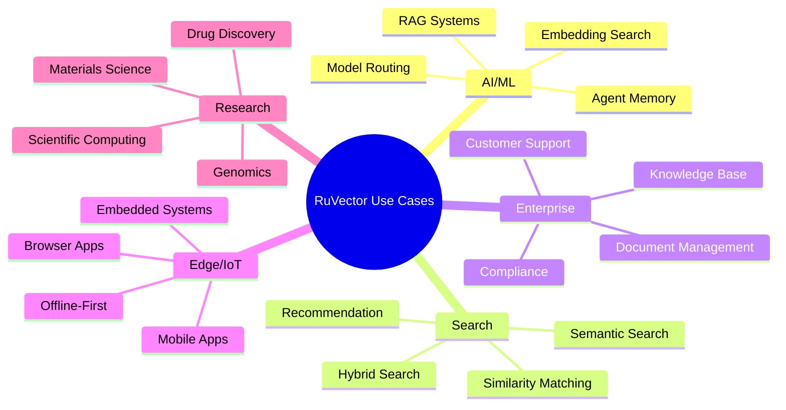

---

## Use Case 1: RAG (Retrieval-Augmented Generation)

### Description
Enhance LLM responses with relevant context from a document corpus.

### Architecture

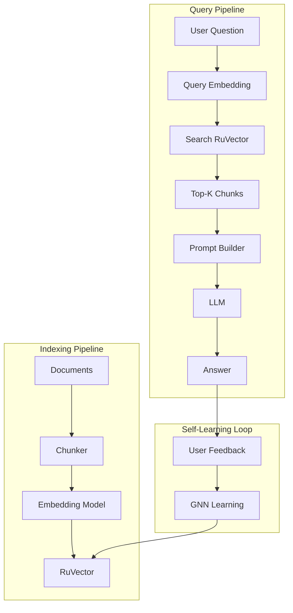

### Implementation

```typescript
// Indexing
const encoder = new TransformerEncoder('sentence-transformers/all-MiniLM-L6-v2');
const db = new VectorDB({ dimensions: 384, distanceMetric: 'cosine' });

for (const doc of documents) {
    const chunks = chunkDocument(doc, { size: 512, overlap: 64 });
    for (const chunk of chunks) {
        const embedding = await encoder.encode(chunk.text);
        await db.insert({
            vector: embedding,
            metadata: { text: chunk.text, source: doc.id }
        });
    }
}

// Querying
async function askQuestion(question: string) {
    const queryEmbedding = await encoder.encode(question);
    const results = await db.search({ vector: queryEmbedding, k: 5 });

    const context = results.map(r => r.metadata.text).join('\n\n');
    const prompt = `Context:\n${context}\n\nQuestion: ${question}\nAnswer:`;

    return llm.generate(prompt);
}
```

### Benefits
- **Self-improving**: GNN learns from user interactions
- **Zero API cost**: Use ruvllm for local LLM inference
- **Fast retrieval**: O(log n) search latency

---

## Use Case 2: AI Agent Memory System

### Description
Persistent, queryable memory for autonomous AI agents using AgenticDB.

### Architecture

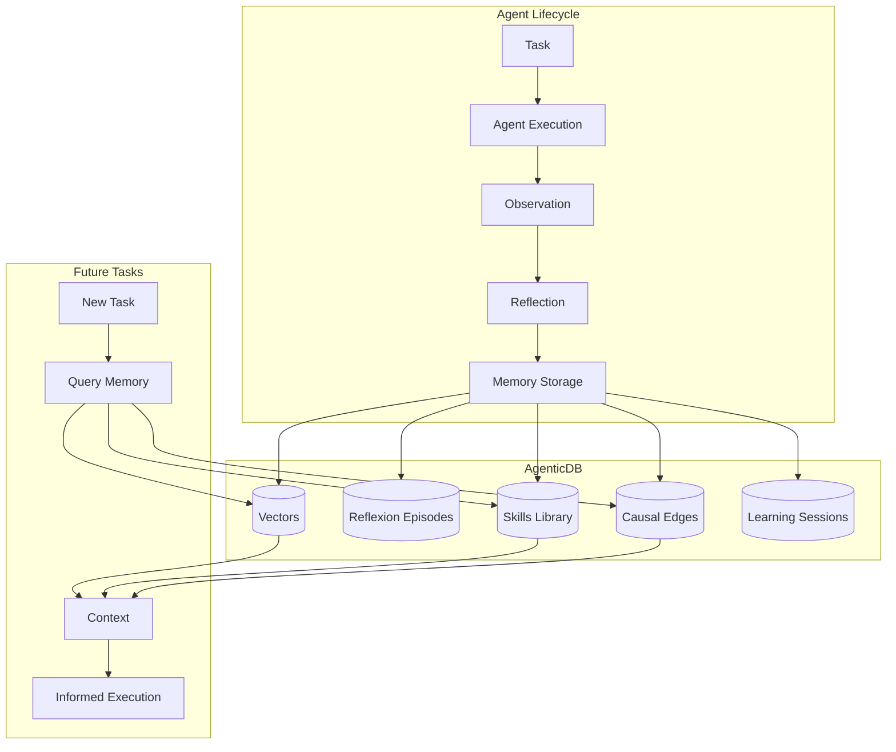

### Implementation

```rust
// Store reflexion episode
db.store_reflexion_episode(ReflexionEpisode {
    thought: "I should check the API documentation first".to_string(),
    action: "read_file('api-docs.md')".to_string(),
    observation: "Found endpoint /users for user management".to_string(),
    critique: "Good approach, but should also check for authentication requirements".to_string(),
    embedding: Some(encoder.encode(&thought)),
})?;

// Query relevant skills for new task
let relevant_skills = db.query_skills(task_embedding, 5)?;
for skill in relevant_skills {
    println!("Skill: {} (success rate: {:.2}%)", skill.name, skill.success_rate * 100.0);
}

// Build causal understanding
db.add_causal_edge(CausalEdge {
    from_id: "api_call".to_string(),
    to_id: "auth_token_refresh".to_string(),
    relationship: "requires".to_string(),
    weight: 0.95,
})?;
```

### Benefits
- **Structured memory**: 5-table schema for different memory types
- **Skill consolidation**: Automatically extract patterns
- **Causal reasoning**: Track cause-effect relationships

---

## Use Case 3: Semantic Document Search

### Description
Search documents by meaning rather than keywords.

### Architecture

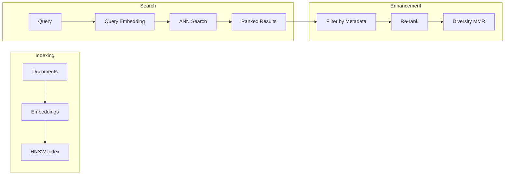

### Supported Query Types

| Query Type | Description | Example |
|------------|-------------|---------|
| **Semantic** | Meaning-based search | "machine learning algorithms" |
| **Filtered** | With metadata constraints | category="tech" AND date>2024 |
| **Hybrid** | Vector + keyword | "python tutorial" + related concepts |
| **MMR** | Diverse results | Top 10 varied documents |

### Implementation

```typescript
// Semantic search
const results = await db.search({
    vector: queryEmbedding,
    k: 10,
    includeMetadata: true
});

// Filtered search
const techResults = await db.search({
    vector: queryEmbedding,
    k: 10,
    filter: { category: 'technology', year: { $gte: 2024 } }
});

// Hybrid search (if using hybrid-enabled build)
const hybridResults = await db.hybridSearch({
    vector: queryEmbedding,
    keywords: 'python tutorial',
    k: 10,
    alpha: 0.7  // 70% semantic, 30% keyword
});
```

---

## Use Case 4: Product Recommendation Engine

### Description
Recommend similar products based on embeddings.

### Architecture

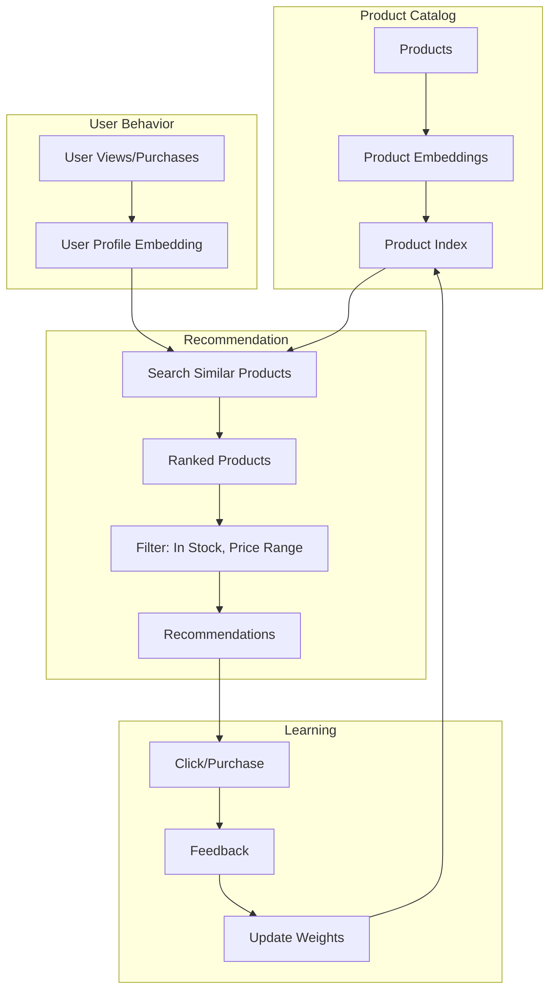

### Implementation

```typescript
// Index products
for (const product of catalog) {
    const embedding = await encoder.encode(product.description);
    await db.insert({
        id: product.id,
        vector: embedding,
        metadata: {
            name: product.name,
            price: product.price,
            category: product.category,
            inStock: product.inventory > 0
        }
    });
}

// Get recommendations for user
async function recommend(userId: string, k: number = 10) {
    const userProfile = await buildUserEmbedding(userId);

    const results = await db.search({
        vector: userProfile,
        k: k * 2,  // Over-fetch for filtering
        filter: { inStock: true }
    });

    // Filter out already purchased
    const purchased = await getPurchasedProductIds(userId);
    return results.filter(r => !purchased.includes(r.id)).slice(0, k);
}

// Track feedback for learning
async function recordInteraction(productId: string, type: 'view' | 'click' | 'purchase') {
    const weights = { view: 0.1, click: 0.3, purchase: 1.0 };
    await db.addFeedback({
        queryId: productId,
        score: weights[type]
    });
}
```

---

## Use Case 5: Code Search & Analysis

### Description
Semantic search over codebases for similar functions, patterns, or bugs.

### Architecture

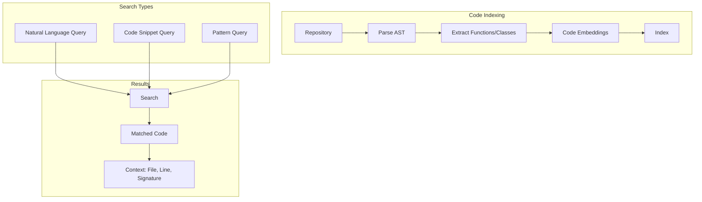

### Implementation

```python
# Index codebase
import tree_sitter
from ruvector import VectorDB

db = VectorDB(dimensions=768, distance_metric='cosine')

def index_file(filepath: str):
    tree = tree_sitter.parse(filepath)
    for node in extract_functions(tree):
        embedding = code_encoder.encode(node.text)
        db.insert(
            vector=embedding,
            metadata={
                'file': filepath,
                'name': node.name,
                'line_start': node.start_point[0],
                'line_end': node.end_point[0],
                'signature': node.signature,
                'docstring': node.docstring
            }
        )

# Search for similar code
def find_similar(code_snippet: str, k: int = 5):
    embedding = code_encoder.encode(code_snippet)
    results = db.search(vector=embedding, k=k)
    return [
        {
            'file': r.metadata['file'],
            'name': r.metadata['name'],
            'line': r.metadata['line_start'],
            'similarity': 1 - r.score
        }
        for r in results
    ]

# Natural language search
def search_by_description(description: str, k: int = 10):
    embedding = text_encoder.encode(description)
    return db.search(vector=embedding, k=k)
```

---

## Use Case 6: Customer Support Automation

### Description
Match customer queries to relevant knowledge base articles and past tickets.

### Architecture

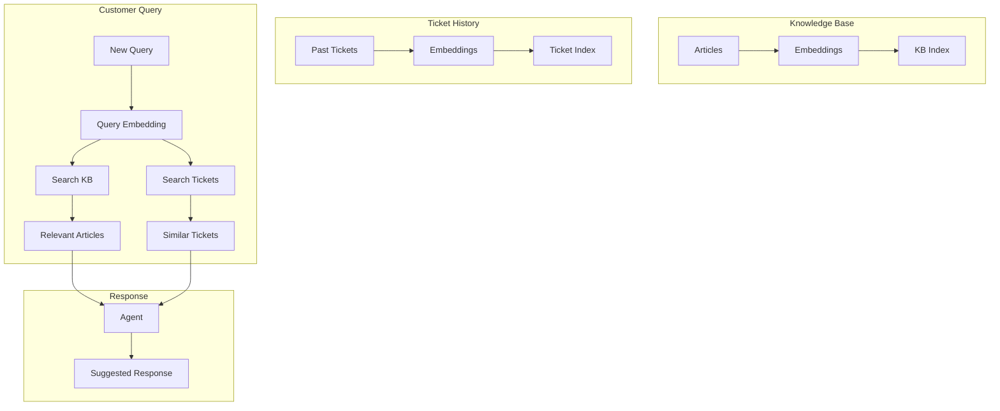

### Implementation

```typescript
// Dual-index system
const kbIndex = new VectorDB({ dimensions: 384, storagePath: './kb.db' });
const ticketIndex = new VectorDB({ dimensions: 384, storagePath: './tickets.db' });

// Handle new query
async function handleQuery(query: string) {
    const embedding = await encoder.encode(query);

    // Search both indexes in parallel
    const [kbResults, ticketResults] = await Promise.all([
        kbIndex.search({ vector: embedding, k: 5 }),
        ticketIndex.search({ vector: embedding, k: 3 })
    ]);

    return {
        articles: kbResults.map(r => ({
            title: r.metadata.title,
            url: r.metadata.url,
            relevance: 1 - r.score
        })),
        similarTickets: ticketResults.map(r => ({
            summary: r.metadata.summary,
            resolution: r.metadata.resolution,
            relevance: 1 - r.score
        }))
    };
}

// Store resolved ticket for future reference
async function recordResolution(ticket: Ticket) {
    const embedding = await encoder.encode(ticket.description);
    await ticketIndex.insert({
        vector: embedding,
        metadata: {
            summary: ticket.summary,
            resolution: ticket.resolution,
            category: ticket.category,
            resolvedBy: ticket.agent
        }
    });
}
```

---

## Use Case 7: Anomaly Detection

### Description
Detect outliers in high-dimensional data using vector similarity.

### Architecture

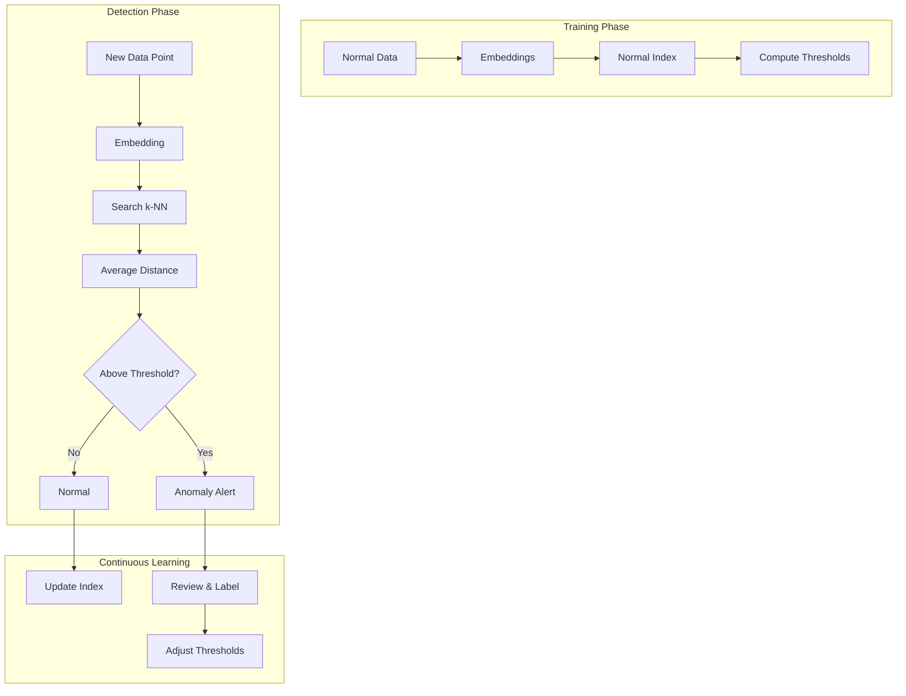

### Implementation

```rust
pub struct AnomalyDetector {
    db: VectorDB,
    threshold: f32,
    k: usize,
}

impl AnomalyDetector {
    pub fn new(dimensions: usize, k: usize) -> Self {
        let db = VectorDB::new(DbOptions {
            dimensions,
            distance_metric: DistanceMetric::Euclidean,
            ..Default::default()
        }).unwrap();

        Self { db, threshold: 0.0, k }
    }

    pub fn train(&mut self, normal_samples: Vec<Vec<f32>>) {
        // Index all normal samples
        for sample in &normal_samples {
            self.db.insert(VectorEntry {
                id: None,
                vector: sample.clone(),
                metadata: None,
            }).unwrap();
        }

        // Compute threshold as mean + 3*std of k-NN distances
        let mut distances = Vec::new();
        for sample in &normal_samples {
            let results = self.db.search(SearchQuery {
                vector: sample.clone(),
                k: self.k + 1,  // +1 because sample is in index
                ..Default::default()
            }).unwrap();

            let avg_dist: f32 = results[1..].iter().map(|r| r.score).sum::<f32>() / self.k as f32;
            distances.push(avg_dist);
        }

        let mean = distances.iter().sum::<f32>() / distances.len() as f32;
        let variance = distances.iter().map(|d| (d - mean).powi(2)).sum::<f32>() / distances.len() as f32;
        let std = variance.sqrt();

        self.threshold = mean + 3.0 * std;
    }

    pub fn is_anomaly(&self, sample: &[f32]) -> (bool, f32) {
        let results = self.db.search(SearchQuery {
            vector: sample.to_vec(),
            k: self.k,
            ..Default::default()
        }).unwrap();

        let avg_dist: f32 = results.iter().map(|r| r.score).sum::<f32>() / self.k as f32;
        (avg_dist > self.threshold, avg_dist)
    }
}
```

---

## Use Case 8: Multi-Modal Search

### Description
Search across text, images, and other modalities using unified embeddings.

### Architecture

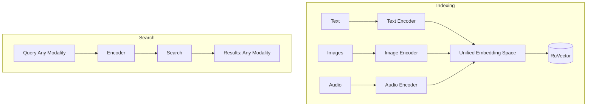

### Implementation

```typescript
import { VectorDB } from 'ruvector';
import { CLIP } from '@models/clip';  // Multi-modal encoder

const db = new VectorDB({
    dimensions: 512,  // CLIP embedding size
    distanceMetric: 'cosine'
});

const clip = await CLIP.load();

// Index mixed content
async function indexContent(content: Content) {
    let embedding: Float32Array;

    switch (content.type) {
        case 'text':
            embedding = await clip.encodeText(content.data);
            break;
        case 'image':
            embedding = await clip.encodeImage(content.data);
            break;
        case 'audio':
            // Convert audio to spectrogram image first
            const spectrogram = audioToSpectrogram(content.data);
            embedding = await clip.encodeImage(spectrogram);
            break;
    }

    await db.insert({
        vector: embedding,
        metadata: {
            type: content.type,
            source: content.source,
            preview: content.preview
        }
    });
}

// Search with any modality
async function multiModalSearch(query: string | ImageData, k: number = 10) {
    const embedding = typeof query === 'string'
        ? await clip.encodeText(query)
        : await clip.encodeImage(query);

    return db.search({ vector: embedding, k, includeMetadata: true });
}
```

---

## Use Case 9: Real-Time Personalization

### Description
Personalize content in real-time based on user embeddings.

### Architecture

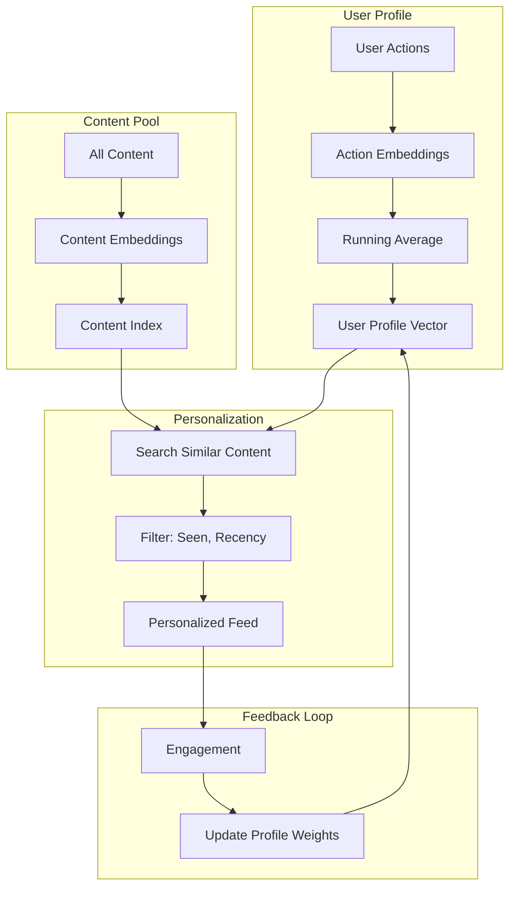

### Implementation

```typescript
class PersonalizationEngine {
    private contentDb: VectorDB;
    private userProfiles: Map<string, Float32Array>;
    private encoder: Encoder;

    async updateUserProfile(userId: string, action: UserAction) {
        const actionEmbedding = await this.encoder.encode(action.content);
        const weights = { view: 0.1, like: 0.5, purchase: 1.0, share: 0.8 };

        const currentProfile = this.userProfiles.get(userId) || new Float32Array(384);
        const weight = weights[action.type];

        // Exponential moving average
        const alpha = 0.1 * weight;
        for (let i = 0; i < 384; i++) {
            currentProfile[i] = (1 - alpha) * currentProfile[i] + alpha * actionEmbedding[i];
        }

        this.userProfiles.set(userId, currentProfile);
    }

    async getPersonalizedFeed(userId: string, k: number = 20) {
        const profile = this.userProfiles.get(userId);
        if (!profile) {
            return this.getDefaultFeed(k);
        }

        const seen = await this.getSeenContentIds(userId);

        // Over-fetch to account for filtering
        const results = await this.contentDb.search({
            vector: Array.from(profile),
            k: k * 3,
            filter: {
                status: 'published',
                createdAt: { $gte: Date.now() - 7 * 24 * 60 * 60 * 1000 }
            }
        });

        return results
            .filter(r => !seen.includes(r.id))
            .slice(0, k);
    }
}
```

---

## Use Case 10: Edge/Mobile AI

### Description
Run vector search directly on mobile devices or in browsers.

### Architecture (WASM)

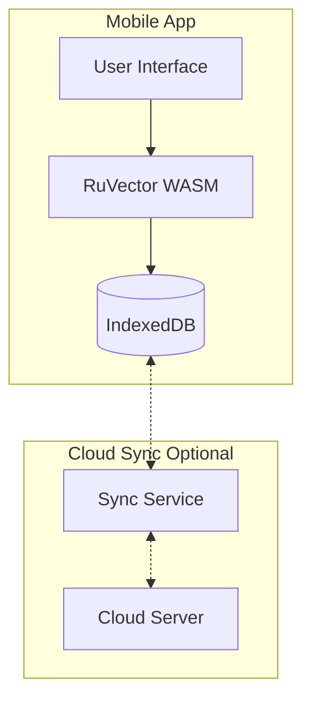

### Implementation

```typescript
// Browser-based vector search
import init, { VectorDB, IndexedDBBackend } from 'ruvector-wasm';

async function initMobileSearch() {
    await init();  // Load WASM

    const storage = await IndexedDBBackend.open('local-vectors');
    const db = new VectorDB({
        dimensions: 128,  // Smaller for mobile
        distanceMetric: 'cosine',
        storage
    });

    return db;
}

// Service Worker for offline search
self.addEventListener('fetch', async (event) => {
    if (event.request.url.includes('/api/search')) {
        event.respondWith(handleLocalSearch(event.request));
    }
});

async function handleLocalSearch(request: Request) {
    const { query } = await request.json();
    const db = await getLocalDb();

    const embedding = await localEncoder.encode(query);
    const results = await db.search({ vector: embedding, k: 5 });

    return new Response(JSON.stringify(results), {
        headers: { 'Content-Type': 'application/json' }
    });
}
```

### Benefits
- **Offline-first**: Works without network
- **Privacy**: Data stays on device
- **Low latency**: No network round-trip
- **Cost**: No server infrastructure

---

## Use Case Matrix

| Use Case | Industry | Scale | Self-Learning | Local LLM | Edge |
|----------|----------|-------|---------------|-----------|------|
| RAG | All | M-XL | ✓ | ✓ | - |
| Agent Memory | AI | S-L | ✓ | ✓ | - |
| Document Search | Enterprise | M-XL | ✓ | - | - |
| Recommendations | E-commerce | L-XL | ✓ | - | ✓ |
| Code Search | Dev Tools | S-L | ✓ | - | - |
| Support Automation | Customer Service | M-L | ✓ | ✓ | - |
| Anomaly Detection | Security/Ops | S-XL | ✓ | - | ✓ |
| Multi-Modal Search | Media | M-XL | ✓ | - | - |
| Personalization | Content | L-XL | ✓ | - | ✓ |
| Mobile AI | Consumer | S-M | - | - | ✓ |

**Scale Key**: S (<100K vectors), M (100K-10M), L (10M-1B), XL (1B+)
