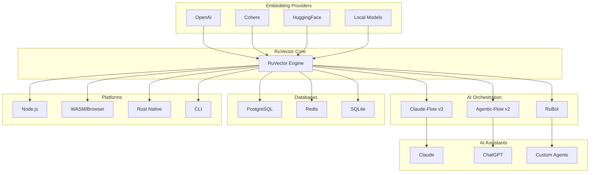
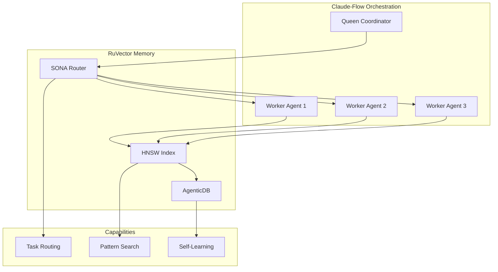
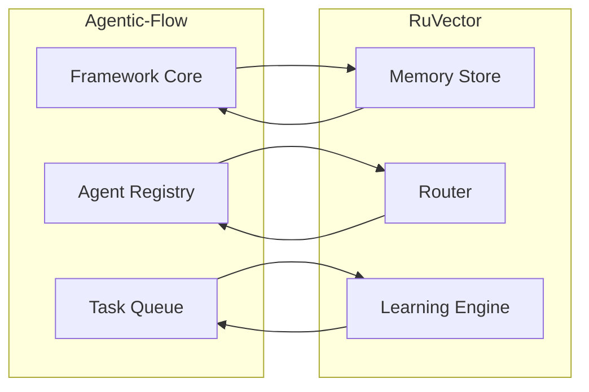
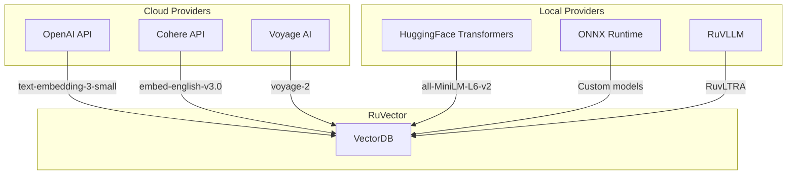
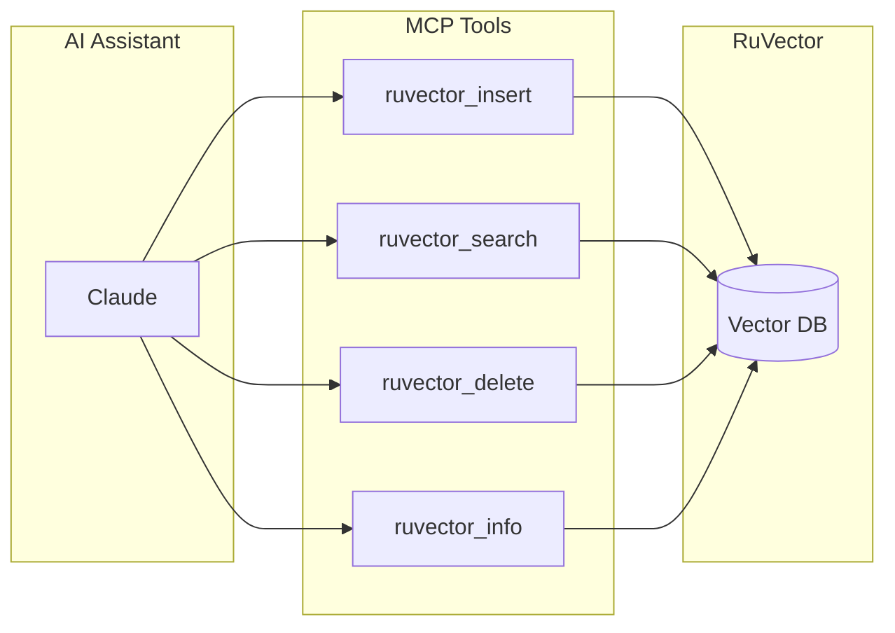

# RuVector Integration Ecosystem

## Overview

RuVector integrates with a comprehensive ecosystem of tools, frameworks, and platforms. This document maps all integration points and provides implementation guidance.

---

## Ecosystem Map



---

## Integration 1: Claude-Flow v3

### Purpose
Multi-agent orchestration with SONA routing and HNSW-backed memory.

### Architecture



### Configuration

```yaml
# claude-flow.config.yaml
memory:
  backend: ruvector
  options:
    dimensions: 384
    distanceMetric: cosine
    storagePath: ./memory.db
    hnsw:
      m: 32
      efConstruction: 200

routing:
  engine: sona
  options:
    layer1_cache_size: 10000
    layer2_model: local  # Use ruvllm

agents:
  - name: researcher
    type: researcher
    memory_namespace: research
  - name: coder
    type: coder
    memory_namespace: code
```

### Usage

```bash
# Initialize with RuVector memory
npx @claude-flow/cli@latest init --memory-backend ruvector

# Start swarm with SONA routing
npx @claude-flow/cli@latest swarm init --topology hierarchical

# Search memory
npx @claude-flow/cli@latest memory search --query "authentication patterns"
```

---

## Integration 2: Agentic-Flow v2

### Purpose
Standalone agent framework with 66 agent types and self-learning patterns.

### Integration Points



### Implementation

```typescript
import { AgenticFlow, Agent } from 'agentic-flow';
import { VectorDB } from 'ruvector';

// Configure RuVector as memory backend
const memory = new VectorDB({
    dimensions: 384,
    storagePath: './agent-memory.db'
});

const flow = new AgenticFlow({
    memory: {
        backend: 'custom',
        instance: memory,
        async store(key: string, value: any) {
            const embedding = await encoder.encode(JSON.stringify(value));
            await memory.insert({
                id: key,
                vector: embedding,
                metadata: { data: value, timestamp: Date.now() }
            });
        },
        async retrieve(query: string, k: number = 5) {
            const embedding = await encoder.encode(query);
            return memory.search({ vector: embedding, k });
        }
    }
});

// Agents automatically use RuVector memory
const agent = flow.spawn('researcher');
await agent.execute('Research machine learning best practices');
```

---

## Integration 3: RuBot Templates

### Purpose
Pre-configured agent templates for common tasks.

### Available Templates

| Template | Description | RuVector Usage |
|----------|-------------|----------------|
| `code-reviewer` | Automated code review | Pattern memory |
| `doc-generator` | Documentation generator | Knowledge base |
| `test-generator` | Test case generator | Example storage |
| `feature-swarm` | Multi-agent feature dev | Shared memory |
| `self-learning-bot` | Adaptive assistant | Full AgenticDB |
| `hive-mind` | Collective intelligence | Distributed memory |

### Deployment

```bash
# Deploy with RuVector memory
npx ruvbot deploy self-learning-bot \
    --domain code-assistance \
    --memory-backend ruvector \
    --memory-path ./bot-memory.db
```

---

## Integration 4: Embedding Providers

### Supported Providers



### Configuration

```typescript
import { VectorDB, EmbeddingProvider } from 'ruvector';

// OpenAI
const openaiProvider = new EmbeddingProvider({
    type: 'openai',
    model: 'text-embedding-3-small',
    apiKey: process.env.OPENAI_API_KEY
});

// Cohere
const cohereProvider = new EmbeddingProvider({
    type: 'cohere',
    model: 'embed-english-v3.0',
    apiKey: process.env.COHERE_API_KEY
});

// Local (ruvllm)
const localProvider = new EmbeddingProvider({
    type: 'local',
    modelPath: './models/ruvltra-0.5b.gguf'
});

// Use with VectorDB
const db = new VectorDB({
    dimensions: 384,
    embeddingProvider: localProvider  // or openaiProvider, cohereProvider
});

// Auto-embed on insert
await db.insert({
    text: "Hello world",  // Auto-embedded if provider configured
    metadata: { source: 'test' }
});
```

### Embedding Comparison

| Provider | Dimensions | Latency | Cost | Quality |
|----------|------------|---------|------|---------|
| OpenAI text-embedding-3-small | 1536 | 100ms | $0.02/1M | High |
| OpenAI text-embedding-3-large | 3072 | 150ms | $0.13/1M | Very High |
| Cohere embed-v3 | 1024 | 80ms | $0.10/1M | High |
| all-MiniLM-L6-v2 | 384 | 10ms | Free | Good |
| RuvLTRA-0.5b | 384 | 5ms | Free | Good |

---

## Integration 5: PostgreSQL

### Purpose
Use RuVector as a high-performance pgvector alternative.

### Installation

```sql
-- Install extension
CREATE EXTENSION ruvector;

-- Create table with vector column
CREATE TABLE documents (
    id SERIAL PRIMARY KEY,
    content TEXT,
    embedding VECTOR(384)
);

-- Create index
CREATE INDEX ON documents
USING ruvector (embedding vector_cosine_ops)
WITH (m = 32, ef_construction = 200);
```

### Migration from pgvector

```sql
-- Step 1: Install ruvector
CREATE EXTENSION ruvector;

-- Step 2: Drop pgvector index
DROP INDEX documents_embedding_idx;

-- Step 3: Create ruvector index (same columns work)
CREATE INDEX documents_embedding_ruvector_idx
ON documents USING ruvector (embedding vector_cosine_ops);

-- Step 4: Queries work the same
SELECT * FROM documents
ORDER BY embedding <=> query_vector
LIMIT 10;
```

### Performance Comparison

| Metric | pgvector | RuVector Extension |
|--------|----------|-------------------|
| Index build (1M vectors) | 45 min | 12 min |
| Search latency | 15ms | 3ms |
| Memory overhead | 800 bytes/vec | 640 bytes/vec |
| SIMD | AVX2 | AVX-512 |

---

## Integration 6: MCP (Model Context Protocol)

### Purpose
Expose RuVector as tools for AI assistants.

### Server Setup

```bash
# Start MCP server
ruvector mcp --transport stdio --database ./vectors.db

# Or with SSE for web
ruvector mcp --transport sse --port 3001
```

### Claude Desktop Configuration

```json
{
    "mcpServers": {
        "ruvector": {
            "command": "ruvector",
            "args": ["mcp", "--transport", "stdio", "--database", "./vectors.db"]
        }
    }
}
```

### Tool Definitions



### Usage in Claude

```
User: Find documents similar to "machine learning algorithms"

Claude: [Calls ruvector_search tool]
I found 5 relevant documents:
1. "Introduction to Neural Networks" (similarity: 0.92)
2. "Deep Learning Fundamentals" (similarity: 0.89)
...
```

---

## Integration 7: LangChain

### Purpose
Use RuVector as a vector store in LangChain pipelines.

### Python Integration

```python
from langchain.vectorstores import RuVector
from langchain.embeddings import OpenAIEmbeddings

# Initialize
embeddings = OpenAIEmbeddings()
vectorstore = RuVector(
    embedding_function=embeddings,
    database_path="./langchain.db",
    distance_metric="cosine"
)

# Add documents
vectorstore.add_documents(documents)

# Search
results = vectorstore.similarity_search("query", k=5)

# Use in chain
from langchain.chains import RetrievalQA
qa = RetrievalQA.from_chain_type(
    llm=llm,
    retriever=vectorstore.as_retriever(k=5)
)
```

### JavaScript Integration

```typescript
import { RuVectorStore } from '@langchain/ruvector';
import { OpenAIEmbeddings } from '@langchain/openai';

const vectorStore = await RuVectorStore.fromDocuments(
    documents,
    new OpenAIEmbeddings(),
    {
        databasePath: './langchain.db',
        distanceMetric: 'cosine'
    }
);

const retriever = vectorStore.asRetriever({ k: 5 });
```

---

## Integration 8: LlamaIndex

### Purpose
Use RuVector as a vector index in LlamaIndex.

### Implementation

```python
from llama_index import VectorStoreIndex, SimpleDirectoryReader
from llama_index.vector_stores import RuVectorStore

# Create vector store
vector_store = RuVectorStore(
    database_path="./llamaindex.db",
    dimensions=384
)

# Create index from documents
documents = SimpleDirectoryReader("./data").load_data()
index = VectorStoreIndex.from_documents(
    documents,
    vector_store=vector_store
)

# Query
query_engine = index.as_query_engine()
response = query_engine.query("What is machine learning?")
```

---

## Integration 9: Vercel AI SDK

### Purpose
Build AI-powered web applications with RuVector RAG.

### Implementation

```typescript
import { RuVectorRAG } from '@ruvector/vercel-ai';
import { OpenAI } from '@ai-sdk/openai';

const rag = new RuVectorRAG({
    database: './vectors.db',
    dimensions: 384
});

export async function POST(req: Request) {
    const { messages } = await req.json();
    const lastMessage = messages[messages.length - 1].content;

    // Retrieve context from RuVector
    const context = await rag.retrieve(lastMessage, { k: 5 });

    // Stream response with context
    return rag.streamResponse({
        model: OpenAI('gpt-4'),
        messages,
        context
    });
}
```

---

## Integration 10: Kubernetes

### Purpose
Deploy RuVector at scale on Kubernetes.

### Helm Chart

```yaml
# values.yaml
replicaCount: 3

image:
  repository: ruvector/server
  tag: latest

persistence:
  enabled: true
  size: 100Gi
  storageClass: fast-ssd

resources:
  requests:
    memory: "8Gi"
    cpu: "4"
  limits:
    memory: "16Gi"
    cpu: "8"

service:
  type: ClusterIP
  port: 3000

autoscaling:
  enabled: true
  minReplicas: 3
  maxReplicas: 10
  targetCPUUtilization: 70
```

### Deployment

```bash
# Install
helm install ruvector ./charts/ruvector -f values.yaml

# Scale
kubectl scale deployment ruvector --replicas=5

# Monitor
kubectl logs -f deployment/ruvector
```

---

## Integration Summary Matrix

| Integration | Type | Complexity | Use Case |
|-------------|------|------------|----------|
| Claude-Flow | AI Orchestration | Medium | Multi-agent systems |
| Agentic-Flow | Framework | Medium | Standalone agents |
| RuBot | Templates | Low | Quick deployment |
| OpenAI/Cohere | Embeddings | Low | Cloud embeddings |
| RuVLLM | Local LLM | Low | Zero-cost inference |
| PostgreSQL | Database | Low | SQL integration |
| MCP | AI Tools | Low | Assistant augmentation |
| LangChain | Framework | Medium | RAG pipelines |
| LlamaIndex | Framework | Medium | Document indexing |
| Vercel AI | Web SDK | Medium | AI web apps |
| Kubernetes | Infrastructure | High | Production scale |

---

## Quick Start Integration Checklist

- [ ] Choose deployment target (Rust/Node.js/WASM/CLI)
- [ ] Select embedding provider (cloud vs local)
- [ ] Configure persistence (file/memory/distributed)
- [ ] Set HNSW parameters based on scale
- [ ] Enable quantization if memory-constrained
- [ ] Set up monitoring and health checks
- [ ] Configure backups if persistence enabled
- [ ] Test integration with sample data
- [ ] Benchmark with production-like load
