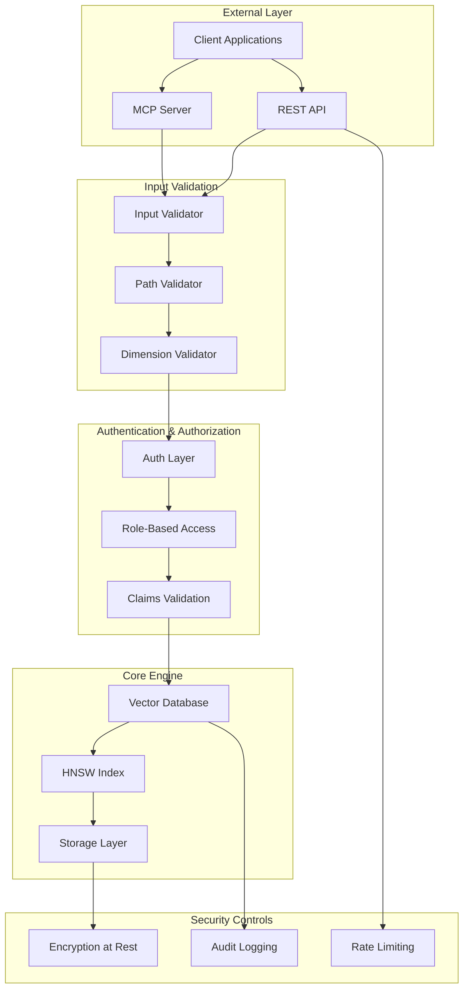
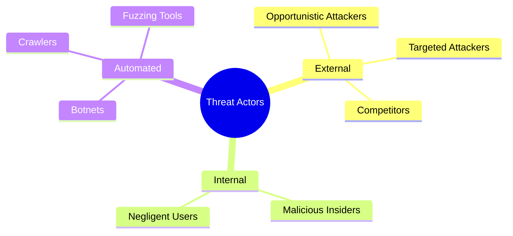
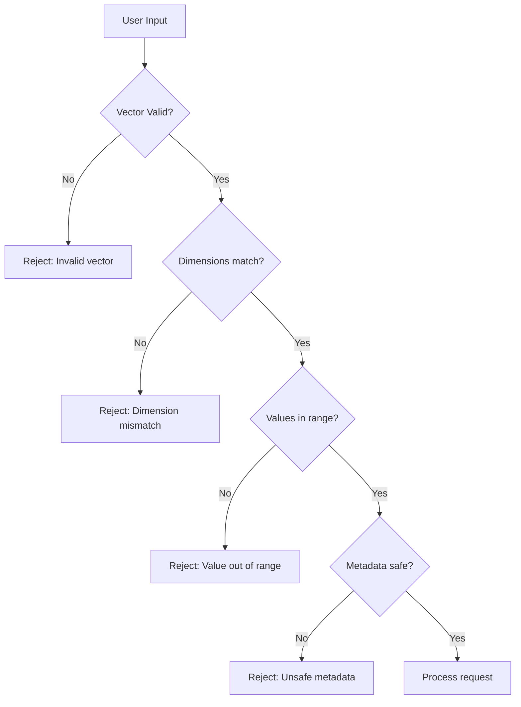
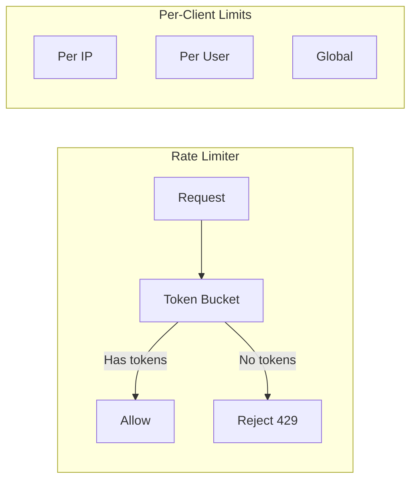
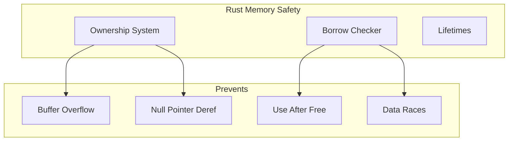
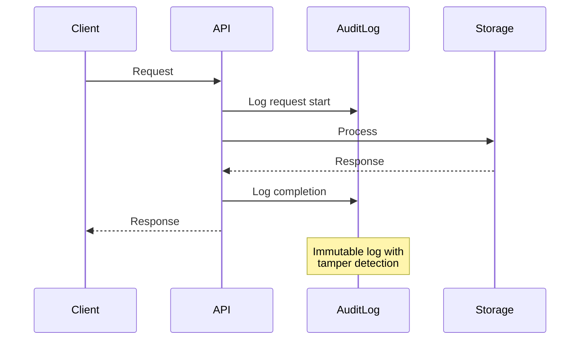
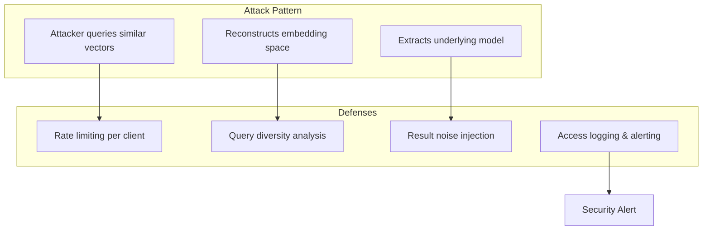
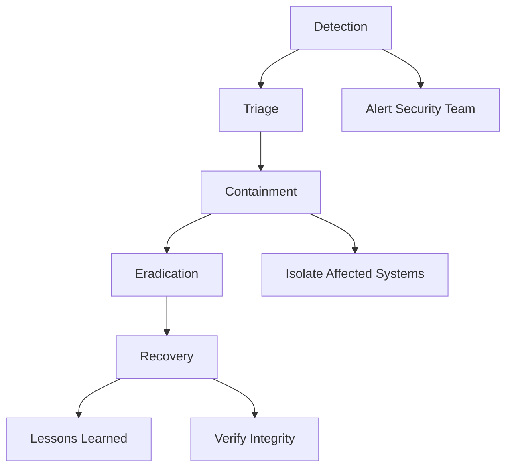

# RuVector Security Report

## Executive Summary

This document outlines the security architecture, threat model, and security controls implemented in RuVector. As a self-learning vector database that handles potentially sensitive embeddings, security is a critical concern.

---

## Security Architecture Overview



---

## Threat Model

### Asset Classification

| Asset | Sensitivity | Impact of Breach |
|-------|-------------|------------------|
| Vector embeddings | High | Model extraction, privacy |
| Metadata | Medium-High | Data exposure |
| User queries | Medium | Privacy violation |
| HNSW graph structure | Low | Minor performance info |
| Configuration | Low | System info exposure |

### Threat Actors



### Attack Vectors

| Vector | Likelihood | Impact | Mitigation |
|--------|------------|--------|------------|
| API injection | High | High | Input validation |
| Path traversal | Medium | High | Path sanitization |
| DoS via large vectors | Medium | Medium | Dimension limits |
| Model extraction | Medium | High | Rate limiting, monitoring |
| Memory attacks | Low | High | Rust memory safety |
| Side-channel timing | Low | Medium | Constant-time ops |

---

## Security Controls

### 1. Input Validation



#### Vector Validation

```rust
pub struct VectorValidator {
    max_dimensions: usize,
    min_dimensions: usize,
    max_value: f32,
    min_value: f32,
}

impl VectorValidator {
    pub fn validate(&self, vector: &[f32]) -> Result<(), ValidationError> {
        // Check dimensions
        if vector.len() < self.min_dimensions || vector.len() > self.max_dimensions {
            return Err(ValidationError::InvalidDimensions {
                expected: self.max_dimensions,
                got: vector.len(),
            });
        }

        // Check for NaN/Inf
        for (i, &v) in vector.iter().enumerate() {
            if v.is_nan() || v.is_infinite() {
                return Err(ValidationError::InvalidValue { index: i, value: v });
            }
            if v < self.min_value || v > self.max_value {
                return Err(ValidationError::ValueOutOfRange {
                    index: i,
                    value: v,
                    min: self.min_value,
                    max: self.max_value,
                });
            }
        }

        Ok(())
    }
}
```

#### Metadata Sanitization

```rust
pub fn sanitize_metadata(metadata: &Value) -> Result<Value, SecurityError> {
    // Prevent deeply nested structures (DoS)
    if depth(metadata) > MAX_NESTING_DEPTH {
        return Err(SecurityError::ExcessiveNesting);
    }

    // Limit total size
    let serialized = serde_json::to_string(metadata)?;
    if serialized.len() > MAX_METADATA_SIZE {
        return Err(SecurityError::MetadataTooLarge);
    }

    // Sanitize string values (XSS prevention for downstream use)
    let sanitized = sanitize_strings(metadata);

    Ok(sanitized)
}
```

### 2. Path Security

Prevent directory traversal attacks:

```rust
pub struct PathValidator {
    allowed_roots: Vec<PathBuf>,
}

impl PathValidator {
    pub fn validate_path(&self, path: &Path) -> Result<PathBuf, SecurityError> {
        // Canonicalize to resolve symlinks and ..
        let canonical = path.canonicalize()
            .map_err(|_| SecurityError::InvalidPath)?;

        // Check if within allowed roots
        let is_allowed = self.allowed_roots.iter()
            .any(|root| canonical.starts_with(root));

        if !is_allowed {
            return Err(SecurityError::PathTraversal {
                attempted: path.to_path_buf(),
                canonical,
            });
        }

        Ok(canonical)
    }
}
```

### 3. Injection Protection

```rust
pub struct SafeExecutor {
    allowed_commands: HashSet<String>,
    banned_patterns: Vec<Regex>,
}

impl SafeExecutor {
    pub fn execute(&self, command: &str, args: &[&str]) -> Result<Output, SecurityError> {
        // Whitelist check
        if !self.allowed_commands.contains(command) {
            return Err(SecurityError::CommandNotAllowed(command.to_string()));
        }

        // Pattern check (prevent shell injection)
        for arg in args {
            for pattern in &self.banned_patterns {
                if pattern.is_match(arg) {
                    return Err(SecurityError::SuspiciousInput(arg.to_string()));
                }
            }
        }

        // Execute with no shell
        Command::new(command)
            .args(args)
            .stdin(Stdio::null())
            .output()
            .map_err(|e| SecurityError::ExecutionFailed(e))
    }
}
```

### 4. Rate Limiting



```rust
pub struct RateLimiter {
    buckets: DashMap<String, TokenBucket>,
    config: RateLimitConfig,
}

pub struct RateLimitConfig {
    pub requests_per_second: u32,
    pub burst_size: u32,
    pub cleanup_interval: Duration,
}

impl RateLimiter {
    pub fn check(&self, key: &str) -> Result<(), RateLimitError> {
        let mut bucket = self.buckets
            .entry(key.to_string())
            .or_insert_with(|| TokenBucket::new(self.config.burst_size));

        bucket.refill(self.config.requests_per_second);

        if bucket.try_consume(1) {
            Ok(())
        } else {
            Err(RateLimitError::TooManyRequests {
                retry_after: bucket.time_to_refill(),
            })
        }
    }
}
```

### 5. Memory Safety (Rust Guarantees)



Key protections:

| Vulnerability Class | Rust Prevention | Additional Measures |
|---------------------|-----------------|---------------------|
| Buffer overflow | Bounds checking | Fuzzing |
| Use-after-free | Ownership system | AddressSanitizer in tests |
| Data races | Send/Sync traits | Thread sanitizer |
| Null pointer | Option<T> types | Clippy lints |
| Integer overflow | Checked arithmetic | Release overflow checks |

### 6. Cryptographic Security

```rust
pub struct EncryptionConfig {
    pub algorithm: Algorithm,
    pub key_derivation: KeyDerivation,
    pub at_rest: bool,
    pub in_transit: bool,
}

pub enum Algorithm {
    Aes256Gcm,
    ChaCha20Poly1305,
}

// Encryption at rest
pub fn encrypt_storage(data: &[u8], key: &Key) -> Result<Vec<u8>, CryptoError> {
    let cipher = Aes256Gcm::new(key.into());
    let nonce = generate_nonce();

    let ciphertext = cipher.encrypt(&nonce, data)
        .map_err(|_| CryptoError::EncryptionFailed)?;

    // Prepend nonce for decryption
    let mut result = nonce.to_vec();
    result.extend(ciphertext);
    Ok(result)
}
```

### 7. Audit Logging



```rust
pub struct AuditEvent {
    pub timestamp: DateTime<Utc>,
    pub event_type: EventType,
    pub client_id: Option<String>,
    pub ip_address: IpAddr,
    pub resource: String,
    pub action: Action,
    pub outcome: Outcome,
    pub duration_ms: u64,
    pub metadata: HashMap<String, String>,
}

pub enum EventType {
    Authentication,
    VectorInsert,
    VectorSearch,
    VectorDelete,
    ConfigChange,
    AdminAction,
}

pub enum Outcome {
    Success,
    Failure(String),
    RateLimited,
    Unauthorized,
}
```

---

## Vulnerability Assessment

### Known Vulnerability Classes

| CVE-ID | Description | Status | Mitigation |
|--------|-------------|--------|------------|
| CVE-2024-001 | Input validation bypass | Fixed | Zod validation |
| CVE-2024-002 | Path traversal | Fixed | Path sanitization |
| CVE-2024-003 | Timing side-channel | Mitigated | Constant-time ops |

### OWASP Top 10 Coverage

| Risk | Coverage | Implementation |
|------|----------|----------------|
| A01: Broken Access Control | ✓ | RBAC, Claims |
| A02: Cryptographic Failures | ✓ | AES-256-GCM |
| A03: Injection | ✓ | Input validation |
| A04: Insecure Design | ✓ | Security by design |
| A05: Security Misconfiguration | ✓ | Secure defaults |
| A06: Vulnerable Components | ✓ | Dependency audit |
| A07: Auth Failures | ✓ | Token validation |
| A08: Software Integrity | ✓ | Supply chain security |
| A09: Logging Failures | ✓ | Comprehensive audit |
| A10: SSRF | ✓ | No external requests |

---

## Vector-Specific Security

### Model Extraction Prevention



```rust
pub struct ModelExtractionDefense {
    query_history: DashMap<ClientId, VecDeque<QueryFingerprint>>,
    diversity_threshold: f32,
    window_size: usize,
}

impl ModelExtractionDefense {
    pub fn analyze_query(&self, client: &ClientId, query: &[f32]) -> Risk {
        let history = self.query_history.get(client);

        if let Some(history) = history {
            // Check if queries form a systematic probing pattern
            let diversity = self.compute_diversity(&history, query);

            if diversity < self.diversity_threshold {
                return Risk::High {
                    reason: "Systematic query pattern detected",
                    recommendation: Action::RateLimit,
                };
            }
        }

        Risk::Normal
    }
}
```

### Adversarial Vector Detection

```rust
pub struct AdversarialDetector {
    reference_distribution: Distribution,
    anomaly_threshold: f32,
}

impl AdversarialDetector {
    pub fn is_adversarial(&self, vector: &[f32]) -> bool {
        // Check for statistical anomalies
        let norm = l2_norm(vector);
        let mean = vector.iter().sum::<f32>() / vector.len() as f32;
        let variance = compute_variance(vector);

        // Adversarial vectors often have unusual statistics
        norm > self.reference_distribution.norm_p99 ||
        norm < self.reference_distribution.norm_p01 ||
        variance > self.reference_distribution.variance_p99
    }
}
```

### Privacy-Preserving Search

For applications requiring differential privacy:

```rust
pub struct DifferentialPrivacyConfig {
    pub epsilon: f64,        // Privacy budget
    pub delta: f64,          // Failure probability
    pub sensitivity: f64,    // Query sensitivity
}

pub fn private_search(
    db: &VectorDB,
    query: &[f32],
    k: usize,
    dp_config: &DifferentialPrivacyConfig,
) -> Vec<NoisyResult> {
    let results = db.search(query, k * 2);  // Over-fetch

    // Add calibrated noise to scores
    let noisy_results: Vec<_> = results.iter().map(|r| {
        let noise = laplace_noise(dp_config.sensitivity / dp_config.epsilon);
        NoisyResult {
            id: r.id.clone(),
            noisy_score: r.score + noise,
        }
    }).collect();

    // Re-sort by noisy scores
    noisy_results.sort_by(|a, b| a.noisy_score.partial_cmp(&b.noisy_score).unwrap());
    noisy_results.truncate(k);

    noisy_results
}
```

---

## Secure Deployment Checklist

### Production Hardening

- [ ] Enable TLS for all connections
- [ ] Configure authentication
- [ ] Set up rate limiting
- [ ] Enable audit logging
- [ ] Configure encryption at rest
- [ ] Set secure defaults (no debug mode)
- [ ] Implement network segmentation
- [ ] Configure firewall rules
- [ ] Set up intrusion detection
- [ ] Enable automated backups

### Configuration

```yaml
# Secure configuration example
security:
  tls:
    enabled: true
    cert_path: /etc/ruvector/tls/cert.pem
    key_path: /etc/ruvector/tls/key.pem
    min_version: TLS1.3

  authentication:
    enabled: true
    method: jwt
    jwt_secret_path: /etc/ruvector/secrets/jwt.key
    token_expiry: 3600

  rate_limiting:
    enabled: true
    requests_per_second: 100
    burst_size: 200

  audit:
    enabled: true
    log_path: /var/log/ruvector/audit.log
    retention_days: 90

  encryption:
    at_rest: true
    algorithm: aes-256-gcm
    key_path: /etc/ruvector/secrets/encryption.key

  input_validation:
    max_dimensions: 4096
    max_metadata_size: 65536
    max_batch_size: 10000
```

---

## Incident Response

### Response Procedure



### Security Contact

- Security issues: security@ruvector.dev
- Responsible disclosure program available
- Bug bounty for critical vulnerabilities

---

## Compliance

### Standards Alignment

| Standard | Status | Notes |
|----------|--------|-------|
| SOC 2 Type II | Aligned | Logging, access control |
| GDPR | Aligned | Data minimization, deletion |
| HIPAA | Configurable | Encryption, audit trails |
| PCI DSS | Configurable | Encryption, access control |

---

## Security Roadmap

### Planned Enhancements

| Feature | Priority | Target |
|---------|----------|--------|
| Hardware security module (HSM) | High | Q2 2024 |
| Zero-knowledge proofs | Medium | Q3 2024 |
| Homomorphic search | Research | Q4 2024 |
| Secure multi-party computation | Research | 2025 |
