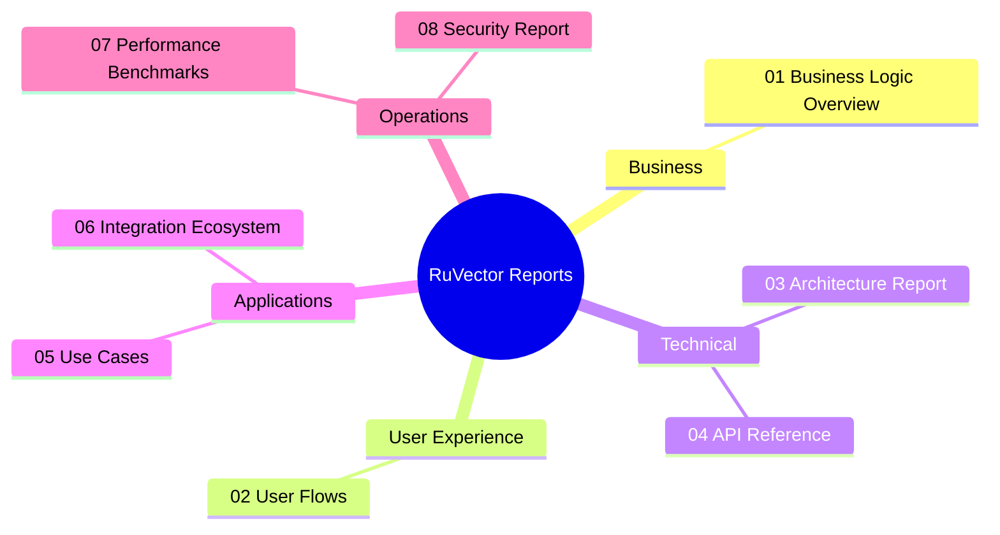
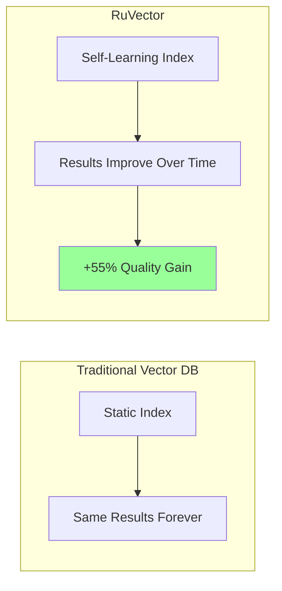
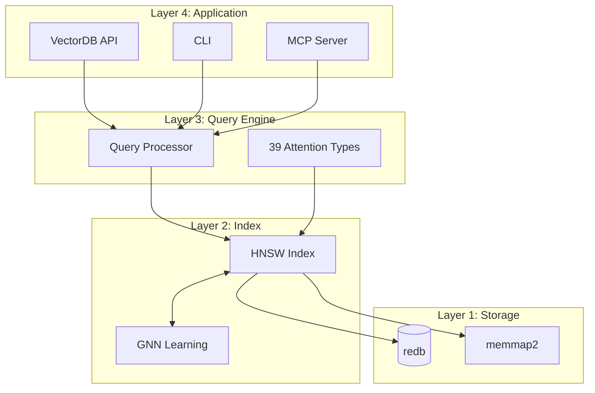
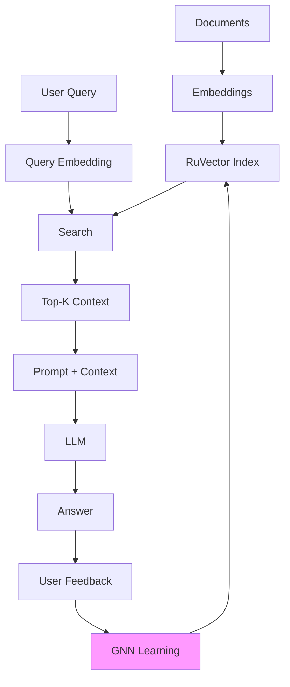
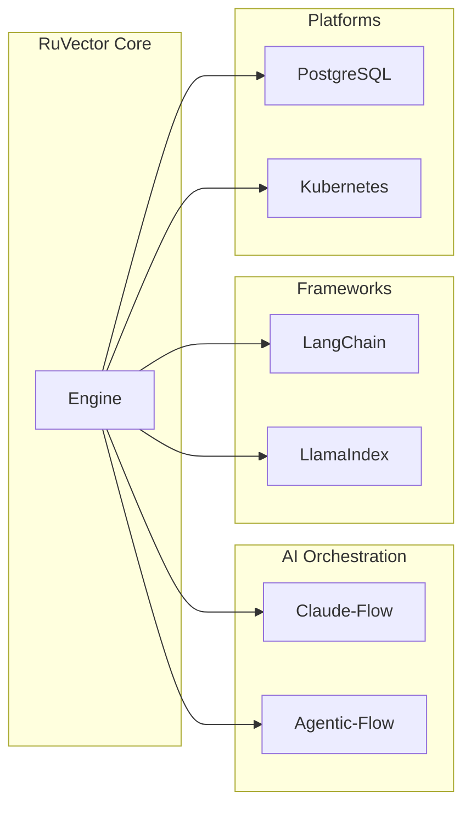

# RuVector Business Logic & Documentation Reports

## Overview

This directory contains comprehensive documentation of RuVector's business logic, user flows, architecture, and technical specifications.

---

## Document Index



---

## Quick Navigation

| Document | Description | Audience |
|----------|-------------|----------|
| [01-BUSINESS-LOGIC-OVERVIEW.md](./01-BUSINESS-LOGIC-OVERVIEW.md) | Core value proposition, competitive analysis, business model | Product, Business |
| [02-USER-FLOWS.md](./02-USER-FLOWS.md) | All user journeys with mermaid diagrams | Product, UX, Dev |
| [03-ARCHITECTURE-REPORT.md](./03-ARCHITECTURE-REPORT.md) | System architecture, layer design, component interactions | Engineering |
| [04-API-REFERENCE.md](./04-API-REFERENCE.md) | Complete API documentation for all platforms | Developers |
| [05-USE-CASES.md](./05-USE-CASES.md) | Industry applications and implementation patterns | Solutions, Sales |
| [06-INTEGRATION-ECOSYSTEM.md](./06-INTEGRATION-ECOSYSTEM.md) | Third-party integrations and ecosystem map | DevRel, Partners |
| [07-PERFORMANCE-BENCHMARKS.md](./07-PERFORMANCE-BENCHMARKS.md) | Performance data, tuning guidelines | DevOps, Engineering |
| [08-SECURITY-REPORT.md](./08-SECURITY-REPORT.md) | Security architecture, threat model, compliance | Security, Compliance |

---

## Executive Summary

### What is RuVector?

**RuVector** is a self-learning vector database built in Rust that improves search results automatically with every query. It combines:

- **High-performance HNSW index** for O(log n) approximate nearest neighbor search
- **GNN learning layer** that updates graph weights based on user feedback
- **39 attention mechanisms** including Flash Attention (7.47× speedup)
- **Multi-platform deployment** (Rust, Node.js, WASM, CLI, PostgreSQL)
- **Local LLM inference** via RuVLLM (zero API costs)

### Core Value Proposition



### Key Differentiators

| Capability | RuVector | Competitors |
|------------|----------|-------------|
| Self-learning | GNN on HNSW | No |
| Local LLM | RuVLLM included | No |
| Graph queries | Cypher support | Limited |
| WASM support | Full | No |
| PostgreSQL ext | Yes | pgvector only |
| Open source | Yes | Varies |

---

## Architecture at a Glance



---

## User Flow Summary

### 20 Documented User Flows

| Category | Flows |
|----------|-------|
| **Basic** | Setup, CRUD Operations, Import/Export |
| **Developer** | Rust, Node.js, WASM, CLI Integration |
| **Production** | Single Node, Distributed, Backup/Recovery |
| **AI/Agent** | RAG, Agent Memory, Multi-Agent, SONA Routing |
| **Integration** | MCP, PostgreSQL, Claude-Flow, Hybrid Search |

### Key Flow: RAG with Self-Learning



---

## API Availability

| Platform | Insert | Search | Delete | Batch | Async |
|----------|--------|--------|--------|-------|-------|
| Rust | ✓ | ✓ | ✓ | ✓ | ✓ |
| Node.js | ✓ | ✓ | ✓ | ✓ | ✓ |
| WASM | ✓ | ✓ | ✓ | ✓ | - |
| CLI | ✓ | ✓ | ✓ | ✓ | - |
| REST | ✓ | ✓ | ✓ | ✓ | - |
| PostgreSQL | ✓ | ✓ | ✓ | ✓ | - |

---

## Use Case Summary

### Top 10 Use Cases

1. **RAG (Retrieval-Augmented Generation)** - Enhance LLM with document context
2. **AI Agent Memory** - Persistent, queryable agent memories (AgenticDB)
3. **Semantic Search** - Find documents by meaning, not keywords
4. **Recommendations** - Product/content similarity matching
5. **Code Search** - Semantic search over codebases
6. **Customer Support** - Match queries to KB articles
7. **Anomaly Detection** - Find outliers in embedding space
8. **Multi-Modal Search** - Search across text, images, audio
9. **Real-Time Personalization** - User profile-based content
10. **Edge/Mobile AI** - Offline-capable WASM deployment

---

## Performance Highlights

| Metric | Value |
|--------|-------|
| Insert throughput | 50-100K vectors/sec |
| Search latency (1M) | 2.1ms |
| Flash Attention speedup | 7.47× |
| SIMD speedup | 4-16× |
| Memory per vector | ~640 bytes |
| Self-learning cycle | 50ms |

---

## Integration Ecosystem



---

## Security Summary

| Control | Status |
|---------|--------|
| Input validation | ✓ Implemented |
| Path traversal prevention | ✓ Implemented |
| Rate limiting | ✓ Implemented |
| Encryption at rest | ✓ Optional |
| Audit logging | ✓ Implemented |
| Memory safety | ✓ Rust guarantees |
| OWASP Top 10 | ✓ Covered |

---

## Quick Start

### Rust

```rust
let db = VectorDB::new(DbOptions {
    dimensions: 384,
    distance_metric: DistanceMetric::Cosine,
    storage_path: "./vectors.db".to_string(),
    ..Default::default()
})?;

db.insert(VectorEntry { vector: embedding, metadata: Some(meta), ..Default::default() })?;
let results = db.search(SearchQuery { vector: query, k: 10, ..Default::default() })?;
```

### Node.js

```javascript
const db = new VectorDB({ dimensions: 384, storagePath: './vectors.db' });
await db.insert({ vector: embedding, metadata: { text: 'Hello' } });
const results = await db.search({ vector: query, k: 10 });
```

### CLI

```bash
ruvector init ./db --dimensions 384
ruvector insert ./db --vector "[0.1, 0.2, ...]" --metadata '{"text": "Hello"}'
ruvector search ./db --vector "[0.1, 0.2, ...]" -k 10
```

---

## Document Maintenance

| Document | Last Updated | Author |
|----------|--------------|--------|
| Business Logic | 2024-01-29 | Auto-generated |
| User Flows | 2024-01-29 | Auto-generated |
| Architecture | 2024-01-29 | Auto-generated |
| API Reference | 2024-01-29 | Auto-generated |
| Use Cases | 2024-01-29 | Auto-generated |
| Integrations | 2024-01-29 | Auto-generated |
| Benchmarks | 2024-01-29 | Auto-generated |
| Security | 2024-01-29 | Auto-generated |

---

## Contributing

To update these documents:

1. Make changes to relevant markdown files
2. Ensure mermaid diagrams render correctly
3. Update the document maintenance table
4. Submit PR for review

---

## License

Documentation is licensed under CC BY 4.0. Code examples are MIT licensed.
